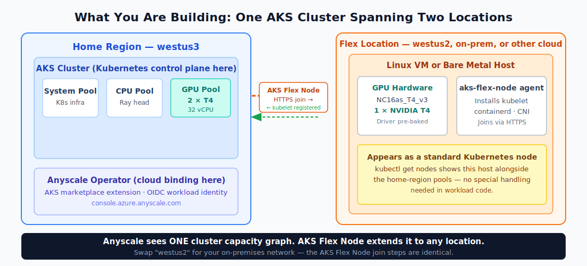

# Run AI Where Your GPUs Are

GPU capacity often sits outside the exact region, cluster, or datacenter where a team wants to run its AI workload. AKS Flex Node lets an AKS cluster use Linux compute wherever you can reach it: another Azure region, an on-premises machine, or another cloud environment. Anyscale on Azure adds the Ray control plane on top, so teams can submit Jobs, manage compute profiles, and observe distributed workers without rewriting the workload for each location. Together, Flex Node and Anyscale let you run Ray AI/ML workloads where your compute and GPUs already are.



## Run The Lab Locally

Use the Docusaurus site as the student view of the lab. From the repository root,
install the docs dependencies once, then start the local docs server:

```bash
npm ci
scripts/docs-dev.sh
```

Open `http://localhost:3000/docs/ai-workloads-on-aks/aks-flex-anyscale-multi-region`
and follow the modules from the browser. This only serves the lab instructions; it
does not create Azure or Anyscale resources until you run the commands inside the
modules. The script restarts the docs server on port 3000 and clears the Docusaurus
cache before serving the site.

## What You Will Learn To Do

In this lab, you learn how to keep AKS as the operating surface for an AI workload even when useful compute sits somewhere else. That pattern matters in organizations with GPU quota in one Azure region, existing machines in a datacenter, or accelerator capacity in another cloud environment. AKS Flex Node gives those Linux hosts a way to join the cluster instead of forcing every workload onto one managed node pool.

You will then connect that cluster to Anyscale on Azure and submit Ray Jobs against the combined capacity. Anyscale gives students and platform teams a managed Ray control plane for Jobs, compute profiles, and workload visibility. Flex Node supplies the reachable compute; Anyscale schedules the Ray AI/ML workload onto the capacity profile you define.

The lab keeps the proof visible. The CPU path gives you a low-cost repeatable run. The GPU path schedules a `GPU:1` Ray worker on a Flex-hosted Tesla T4 and proves that pod landed on `agentpool=aksflexnodes`, not on an AKS managed GPU node pool. You also use workload identity to write proof data to Azure Blob Storage without shared keys or SAS tokens, then tear the lab down and verify Terraform state is empty.

## Reference Topology

These values are the validated reference shape, not hard-coded requirements. Copy
`.env-template` to `.env`, then change the region and VM-size `TF_VAR_*` values to
match quota and capacity in your subscription. The helper scripts render those
values into `infra/terraform/terraform.auto.tfvars.json` before Terraform runs.

| Layer | Reference value | Purpose |
| --- | --- | --- |
| Home region | `westus2` | AKS, storage, ACR, observability, Anyscale cloud binding |
| CPU Flex region | `westus3` | Lower-cost cross-region Flex worker path |
| AKS CPU node pool SKU | `Standard_D16s_v5` (`TF_VAR_cpu_vm_size`) | Home-region CPU pool used when Anyscale needs AKS CPU capacity |
| CPU Flex host SKU | `Standard_D4s_v5` (`TF_VAR_flex_host_vm_size`) | Cheapest repeatable Flex worker shape for the CPU-only path |
| GPU Flex region | `southcentralus` in the validated run | T4 Flex worker path when `westus3` T4 capacity is unavailable |
| Flex agent pool label | `aksflexnodes` | Placement target for proof workers |
| GPU product label | `nvidia.com/gpu.product=NVIDIA-T4` | Selector required by Anyscale T4 worker pods |
| Anyscale control plane | `https://console.azure.anyscale.com` | Anyscale on Azure console and Jobs API |
| Proof workload | `workloads/deepspeed_finetune/train.py` | Ray Train + DeepSpeed proof with structured evidence |

## Workshop Flow

Work through the modules in order. You start by checking that your subscription,
tools, and chosen CPU or GPU path are ready. Then you build the AKS foundation,
attach a Flex host from a second location, bind the cluster to Anyscale on Azure,
and run the preflight gates that make the proof job meaningful. The last two
modules produce the evidence students should keep: Anyscale Job output, proof
summary JSON, Kubernetes placement JSON, and teardown checks that show the lab is
gone cleanly.

| Module | Outcome |
| --- | --- |
| [1: Environment Setup](docs/ai-workloads-on-aks/module-01-environment-setup.mdx) | Install tools, authenticate, choose CPU or GPU path, check quota |
| [2: AKS Foundation](docs/ai-workloads-on-aks/module-02-aks-foundation.mdx) | Deploy AKS, storage, ACR, identity, observability, and networking |
| [3: Flex Node](docs/ai-workloads-on-aks/module-03-flex-node.mdx) | Provision and join the Flex host as a Kubernetes node |
| [4: Anyscale Binding](docs/ai-workloads-on-aks/module-04-anyscale-binding.mdx) | Create the Anyscale cloud, assign user RBAC, install the AKS extension, verify Gateway API |
| [5: Preflight Gates](docs/ai-workloads-on-aks/module-05-autoscaling.mdx) | Verify autoscaling, Flex networking, DNS, Gateway, and GPU readiness when enabled |
| [6: Workload Proof](docs/ai-workloads-on-aks/module-06-workload-proof.mdx) | Submit CPU/GPU Anyscale Jobs and validate proof summaries plus pod placement |
| [7: Teardown](docs/ai-workloads-on-aks/module-07-teardown.mdx) | Destroy the lab and verify no current lab resources remain |

## Start Here

Open [Run AI Where Your GPUs Are](docs/ai-workloads-on-aks/aks-flex-anyscale-multi-region.mdx), then follow the modules in order. That is the student path: each module explains what you are building, which command to run, and what evidence proves the step worked.

The repository also includes an operator script for testing, demos, and fast-forwarding through parts of the lab:

```bash
./scripts/anyscale-aks.sh <doctor|apply|status|destroy>
```

Use the script when you need to validate the lab end to end or repeat a known path quickly. If you are learning the lab, start in the module text and use the script only when a module tells you to.

Use `.env-template` as the source for your local `.env`. The CPU path is the cheapest repeatable route for students and testers. The GPU path requires T4 quota, a GPU-capable Flex host image, the NVIDIA device plugin, and the `NVIDIA-T4` product label applied to the Flex node.

## Success Evidence

After Module 6, keep the proof files under `.cache/anyscale/proofs/`. The two
files that matter most are the proof summary and the Kubernetes placement JSON.
The proof summary shows the workload ran, wrote evidence through workload identity,
and reported the expected region and device details. The placement JSON shows
which Kubernetes node ran each Ray pod.

For the CPU path, the Ray worker should land on a `vm-flex-...` node with
`node_agentpool="aksflexnodes"`, and its region should match `TF_VAR_flex_region`.
For the GPU path, look for the same Flex placement plus `cuda_available=true`,
`device_name="Tesla T4"`, and an `observed_region_hint` that matches the Flex
region. A successful Anyscale Job alone is not enough; the placement artifact is
what proves the worker used Flex capacity.

The proof path uses Anyscale Jobs. Seeing Jobs without Workspaces in the Anyscale
console is expected.

## Teardown

Finish with:

```bash
./scripts/run-lab-e2e.sh teardown
```

The current lab is clean only when the resource group is deleted and `terraform -chdir=infra/terraform state list` returns no resources. Stale Azure Anyscale control-plane entries without backing Azure ARM resources cannot be removed by `anyscale cloud delete`; they require provider-side cleanup.
