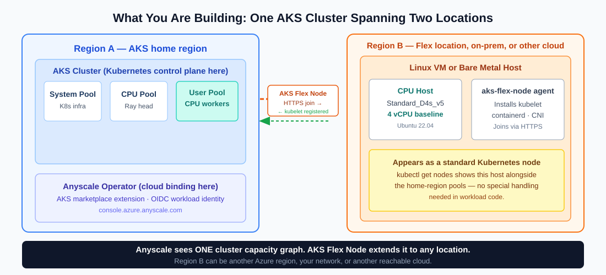

# Run AI Where Your GPUs Are

GPU capacity often sits outside the exact region, cluster, or datacenter where a team wants to run its AI workload. AKS Flex Node lets an AKS cluster use Linux compute wherever you can reach it: another Azure region, an on-premises machine, or another cloud environment. Anyscale on Azure adds the Ray control plane on top, so teams can submit Jobs, manage compute profiles, and observe distributed workers without rewriting the workload for each location. Together, Flex Node and Anyscale let you run Ray AI/ML workloads where your compute and GPUs already are.



## Run the lab locally

Use the Docusaurus site to follow the lab. From the repository root, install the
documentation dependencies once, then start the local site:

```bash
npm ci
scripts/docs-dev.sh
```

Open `http://localhost:3000/docs/ai-workloads-on-aks/aks-flex-anyscale-multi-region`
and follow the modules from the browser. This only serves the lab instructions; it
does not create Azure or Anyscale resources until you run the commands inside the
modules. The script restarts the docs server on port 3000 and clears the Docusaurus
cache before serving the site.

After you sign in with `az login`, prepare the local deployment files and tools:

```bash
./scripts/anyscale-aks.sh bootstrap
./scripts/anyscale-aks.sh doctor
```

Bootstrap copies `.env-template` to the ignored `.env` file, records the active
Azure subscription and tenant, creates the configured SSH key when needed, and
installs the Anyscale CLI in `.venv`.

## What you will learn

In this lab, you learn how to keep AKS as the operating surface for an AI workload even when useful compute sits somewhere else. That pattern matters in organizations with GPU quota in one Azure region, existing machines in a datacenter, or accelerator capacity in another cloud environment. AKS Flex Node gives those Linux hosts a way to join the cluster instead of forcing every workload onto one managed node pool.

You will then connect that cluster to Anyscale on Azure and submit a Ray Job to
the combined capacity. Anyscale provides the Ray control plane for Jobs, compute
profiles, and workload visibility. Flex Node supplies the reachable compute, and
Anyscale schedules the workload onto the nodes you select.

Choose the CPU or GPU path supported by quota and capacity in your Azure
environment. The GPU path schedules a `GPU:1` Ray worker on the configured Flex
host. In either path, you will inspect Kubernetes placement data to confirm that the worker ran on
`agentpool=aksflexnodes`. You will also write workload results to Azure Blob
Storage with workload identity, then remove the environment and confirm that
Terraform state is empty.

## Reference Topology

These values are the validated reference shape, not hard-coded requirements. Copy
`.env-template` to `.env`, then change the region and VM-size `TF_VAR_*` values to
match quota and capacity in your subscription. The deployment command passes
those values to Terraform.

| Layer | Reference value | Purpose |
| --- | --- | --- |
| Region A | Value of `TF_VAR_azure_location` | AKS, storage, ACR, observability, Anyscale cloud binding |
| Region B | Value of `TF_VAR_flex_region` | Cross-region Flex worker path for CPU or GPU runs |
| AKS CPU node pool SKU | Value of `TF_VAR_cpu_vm_size` | Home-region CPU pool used when Anyscale needs AKS CPU capacity |
| Flex host SKU | Value of `TF_VAR_flex_host_vm_size` | CPU or GPU VM size selected for the Flex worker |
| Flex agent pool label | `aksflexnodes` | Placement target for Ray workers |
| GPU product label | Value of `ANYSCALE_RESULTS_GPU_PRODUCT_LABEL` | Product selector for the configured Anyscale GPU worker |
| Anyscale control plane | `https://console.azure.anyscale.com` | Anyscale on Azure console and Jobs API |
| Workload | `workloads/deepspeed_finetune/train.py` | Ray Train and DeepSpeed workload with structured results |

## Module flow

Work through the modules in order. You start by checking that your subscription,
tools, and chosen CPU or GPU path are ready. Then you build the AKS foundation,
attach a Flex host from a second location, bind the cluster to Anyscale on Azure,
confirm that the workload path is healthy, and run a distributed Ray workload.
The last two modules produce the results you should keep: Anyscale Job output,
summary JSON, Kubernetes placement JSON, and cleanup checks showing that the
Azure resources are gone.

| Module | Outcome |
| --- | --- |
| [1: Prepare Your Environment](docs/ai-workloads-on-aks/module-01-environment-setup.mdx) | Sign in, check tools and quota, and choose the CPU or GPU path |
| [2: Build the AKS Foundation](docs/ai-workloads-on-aks/module-02-aks-foundation.mdx) | Create AKS, storage, a container registry, identity, observability, and networking |
| [3: Connect a Flex Node](docs/ai-workloads-on-aks/module-03-flex-node.mdx) | Create the Flex host, join it to AKS, and verify pod connectivity |
| [4: Connect Anyscale](docs/ai-workloads-on-aks/module-04-anyscale-binding.mdx) | Create the Anyscale cloud, assign user access, install the AKS extension, and verify the Gateway |
| [5: Review Scaling and Readiness](docs/ai-workloads-on-aks/module-05-autoscaling.mdx) | Confirm autoscaling, Flex networking, DNS, Gateway, and GPU availability when selected |
| [6: Run the Workload](docs/ai-workloads-on-aks/module-06-workload-results.mdx) | Submit the Anyscale Job, inspect its results, and confirm pod placement |
| [7: Remove the Environment](docs/ai-workloads-on-aks/module-07-teardown.mdx) | Stop active jobs, delete Azure resources, and confirm cleanup |

## Start Here

Open [Run AI Where Your GPUs Are](docs/ai-workloads-on-aks/aks-flex-anyscale-multi-region.mdx),
then follow the modules in order. Each module explains what you will create, why
it matters, which command to run, and what you should see before continuing.

Use `.env-template` as the source for your local `.env`. Choose the CPU or GPU
path supported by your Azure environment. The GPU path requires quota for the
selected VM size, a compatible Flex host image, the NVIDIA device plugin, and
the matching product label on the Flex node.

## Results to keep

After Module 6, keep the files under `.cache/anyscale/results/`. The two files that
matter most are `workload-summary.json` and the Kubernetes placement JSON. The
summary shows that the workload completed, wrote its result through workload
identity, and reported the expected region and device details. The placement JSON
shows which Kubernetes node ran each Ray pod.

For the CPU path, the Ray worker should land on a `vm-flex-...` node with
`node_agentpool="aksflexnodes"`, and its region should match `TF_VAR_flex_region`.
For the GPU path, look for the same Flex placement plus `cuda_available=true`, a
`device_name` that matches the selected accelerator, and an
`observed_region_hint` that matches the Flex region. A successful Anyscale Job
alone is not enough; the placement artifact is what shows that the worker used
Flex capacity.

This lab uses Anyscale Jobs. Seeing Jobs without Workspaces in the Anyscale
console is expected.

## Teardown

Finish with:

```bash
./scripts/anyscale-aks.sh destroy
./scripts/validate-lab.sh teardown
```

The current lab is clean only when the resource group is deleted and `terraform -chdir=infra/terraform state list` returns no resources. Stale Azure Anyscale control-plane entries without backing Azure ARM resources cannot be removed by `anyscale cloud delete`; they require provider-side cleanup.
