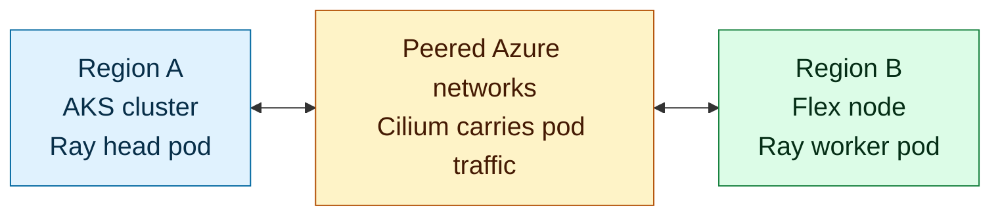
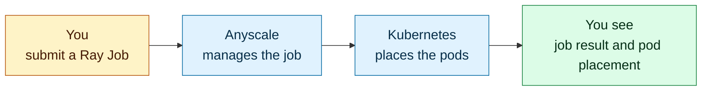

GPU capacity is often constrained, and useful compute does not always sit beside
the platform that needs it. It may be available in another Azure region, in your
datacenter, or through another cloud provider. This lab shows how to bring
reachable Linux compute into one AKS cluster and use it for a distributed AI
workload.

You will use **AKS Flex Node** to join a Linux host outside the AKS managed node
pools as a worker node. **Anyscale on Azure** adds managed Ray Jobs, compute
configs, and workload observability. Together, they give you one place to submit
the workload while Kubernetes places its parts on the capacity selected for the
job.

The lab runs a Ray Train and DeepSpeed fine-tuning demonstration across two
locations. The Ray head runs on an AKS node in Region A, and the Ray worker runs
on a Flex node in Region B. You will inspect the resources that connect those
locations, submit the job, and compare its reported result with Kubernetes pod
placement. The CPU and GPU routes use the same placement pattern; choose the one
supported by the quota and capacity in your Azure environment.

The two-region deployment keeps the exercise concrete. The AKS Flex Node model
also supports reachable Linux machines in a datacenter or another cloud when
the required network path is already in place. This lab does not create those
external networks or autoscale the Flex host. It gives you a tested blueprint
for joining capacity, directing a Ray worker to it, and seeing where the work
ran.

:::info What you will see
The Anyscale Job reaches `SUCCEEDED`, the workload summary records the worker's
view of its location, and Kubernetes placement results show the Ray worker on
the Flex node in Region B. Together, these results show where the workload ran
without relying on a dashboard alone.
:::

## Prerequisites

- An Azure subscription with permission to create AKS, networking, storage, and monitoring resources
- Azure CLI installed and authenticated
- Terraform 1.9 or later
- Basic familiarity with AKS, Kubernetes, and managed identities

Before you deploy anything, you will check the regional quota and host
requirements for your CPU or GPU route.

## Architecture

In this setup, **Region A** hosts the AKS cluster and the Ray head pod. A
reachable Linux host in **Region B** joins that same cluster as an AKS Flex node
and runs the Ray worker pods. **Anyscale on Azure** submits and observes the
distributed fine-tuning job, and you'll use Kubernetes placement data (node
names, node pools, and regions) to see exactly where each pod ran.

### Where the compute runs

<!-- Keep this diagram in sync with assets/architecture/01-solution-overview.mmd. -->

### How the job gets there, and where you see it run

<!-- Keep this diagram in sync with assets/architecture/01-job-and-results.mmd. -->

AKS Flex Node is what lets the Linux host in Region B take part in the AKS
cluster even though it is not part of an AKS managed node pool. It prepares and
joins that host as a Kubernetes worker, so Kubernetes can place the Ray worker
pod there just as it places the Ray head pod on an AKS node. Flex Node handles
the host's connection to the cluster, while Cilium gives pods on both types of
node a network path to each other.

Behind that flow, the Anyscale control plane sends your workload to the Anyscale
operator in AKS. The operator creates the Ray resources, Kubernetes places the
pods on the matching nodes, and Cilium carries traffic between them over the
peered VNets. The workload saves its results in `workload-summary.json`. After
the job finishes, you check that file alongside the cluster's pod details to
confirm that the Ray head ran in Region A and the worker ran in Region B.

## Modules

| Module | What you do |
| --- | --- |
| [1: Prepare Your Environment](./module-01-environment-setup) | Sign in and check the tools and quota you'll need, then choose the CPU or GPU path available in your Azure environment. |
| [2: Build the AKS Foundation](./module-02-aks-foundation) | Create the AKS cluster, storage, a container registry, and the cross-region networking that will connect AKS to the Flex host. |
| [3: Connect a Flex Node](./module-03-flex-node) | Provision a Flex host in a second region, join it to your AKS cluster as a Flex node, and verify that pods can communicate across both regions. |
| [4: Connect Anyscale](./module-04-anyscale-binding) | Add the Anyscale cloud, deploy the Anyscale operator, and configure the Gateway so you can submit and observe Ray Jobs. |
| [5: Review Scaling and Readiness](./module-05-autoscaling) | Inspect AKS scaling behavior, confirm Flex networking is working, and verify that the cluster is ready for the distributed workload. |
| [6: Run the Workload](./module-06-workload-results) | Submit a distributed fine-tuning job, then compare its summary with Kubernetes placement data to see where the Ray head and worker pods ran. |
| [7: Remove the Environment](./module-07-teardown) | Stop active jobs, delete the Azure resources you created, and confirm that both resource groups and Terraform state are empty. |
