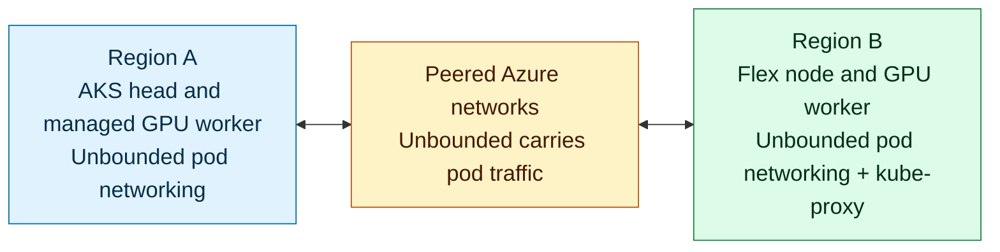
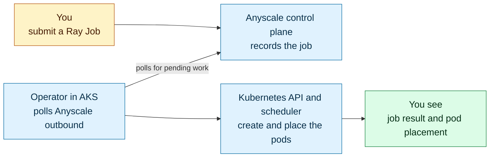

GPU capacity is often constrained, and useful compute does not always sit beside
the platform that needs it. In this lab, you bring a second Linux host into the
same AKS cluster and use it for a distributed AI workload. You will keep your
job submission in one place while the Kubernetes
[scheduler](https://kubernetes.io/docs/concepts/scheduling-eviction/kube-scheduler/)
places the Ray head and worker pods where the cluster has capacity.

You will use **AKS Flex Node** to join a Linux host outside the AKS managed node
pools as a worker node. **Anyscale on Azure** adds managed Ray Jobs, compute
configs, and workload observability. Together, they let you submit one job while
Kubernetes places its parts across AKS and Flex.

The lab runs a Ray Train and DeepSpeed fine-tuning demonstration across two
locations. The Ray head runs on an AKS CPU node in Region A. In GPU mode, one
training rank runs on a managed AKS GPU node and another runs on a Flex GPU node
in Region B. You will compare per-rank training records with Kubernetes
placement.

This lab creates a repeatable Azure topology. AKS is configured with
`networkPlugin=none`, so AKS does not install a Container Network Interface
([CNI](https://kubernetes.io/docs/concepts/extend-kubernetes/compute-storage-net/network-plugins/))
plugin. [Unbounded](https://github.com/Azure/unbounded) provides pod networking
for the managed AKS nodes and the Flex VM. Module 2 creates a peered Azure VNet
for the Flex host, then the later modules verify that the workload spans both
node pools.

To run the pattern again, use a new project or environment value in your local
`.env` profile, then deploy again. The resource group name comes from those
values and the home-region label, which keeps a new run separate from an earlier
one.

:::info What you will see
The Anyscale Job reaches `SUCCEEDED`, both ranks report CUDA and completed steps,
and the joined proof shows concurrent workers on managed AKS and Flex. These
records prove where training ran without relying on a dashboard alone.
:::

## Before you begin

If Ray, AKS Flex Node, or Anyscale are new to you, read
[Key Concepts](./key-concepts) first. It is a short page that explains what each
one does and defines the terms the modules use.

Module 1 lists the Azure permissions, local tools, regional quota, and CPU or GPU
host requirements to check before you create any resources.

Review [Module 1: Prepare Your Environment](./module-01-environment-setup) before
you begin, even if you have run another AKS lab in the same terminal.

## Architecture

In this setup, **Region A** hosts the AKS cluster, Ray head pod, and managed GPU
worker. A
reachable Linux host in **Region B** joins that same cluster as an AKS Flex node
and runs the Ray worker pods. **Anyscale on Azure** submits and observes the
distributed fine-tuning job, and you'll use Kubernetes placement data (node
names, node pools, and regions) to see exactly where each pod ran.

### Where the compute runs

<!-- Keep this diagram in sync with assets/architecture/01-solution-overview.mmd. -->

### How the job gets there, and where you see it run

<!-- Keep this diagram in sync with assets/architecture/01-job-and-results.mmd. -->

AKS Flex Node is what lets the Linux host in Region B take part in the AKS
cluster even though it is not part of an AKS managed node pool. It prepares and
joins that host as a Kubernetes worker, so Kubernetes can place the Ray worker
pod there just as it places the Ray head pod on an AKS node. Flex Node handles
the host's connection to the cluster. The AKS cluster runs with
`networkPlugin=none`, so Unbounded provides pod networking for the managed AKS
nodes and the Flex node, and carries pod traffic between the two regions over the
peered VNets.

Behind that flow, the Anyscale operator in AKS polls the Anyscale control plane
over an outbound connection. When it finds pending work, the operator creates
the Ray resources through the Kubernetes API, the scheduler places the pods on
matching nodes, and Unbounded carries traffic between them. The workload saves
its results in `workload-summary.json`. After the job finishes, you check that
file alongside the cluster's pod details to confirm that the Ray head ran in
Region A and the two GPU ranks ran on managed AKS and Flex.

## Modules

| Module | What you do |
| --- | --- |
| [Key Concepts](./key-concepts) | Learn what Ray, AKS Flex Node, Anyscale, and Unbounded each contribute, and the terms the modules use. |
| [1: Prepare Your Environment](./module-01-environment-setup) | Sign in and check the tools and quota you'll need, then choose the CPU or GPU path available in your Azure environment. |
| [2: Build the AKS Foundation](./module-02-aks-foundation) | Create the AKS cluster, storage, a container registry, the Flex VM, and the cross-region networking between them. |
| [3: Connect a Flex Node](./module-03-flex-node) | Join the provisioned VM to your AKS cluster as a Flex node, and verify that pods can communicate across both regions. |
| [4: Connect Anyscale](./module-04-anyscale-binding) | Add the Anyscale cloud, deploy the Anyscale operator, and configure the Gateway so you can submit and observe Ray Jobs. |
| [5: Review Scaling and Readiness](./module-05-autoscaling) | Inspect AKS scaling behavior, confirm Flex networking is working, and verify that the cluster is ready for the distributed workload. |
| [6: Run the Workload](./module-06-workload-results) | Submit a distributed fine-tuning job, then compare its summary with Kubernetes placement data to see where the Ray head and worker pods ran. |
| [7: Remove the Environment](./module-07-teardown) | Stop active jobs, delete the Azure resources you created, and confirm that both resource groups and Terraform state are empty. |

Start with **[Key Concepts](./key-concepts)** if the technologies are new to you,
or go straight to
**[Module 1: Prepare Your Environment](./module-01-environment-setup)**.
Module 1 validates your workstation and subscription without creating Azure
resources; the first deployment happens in Module 2.
