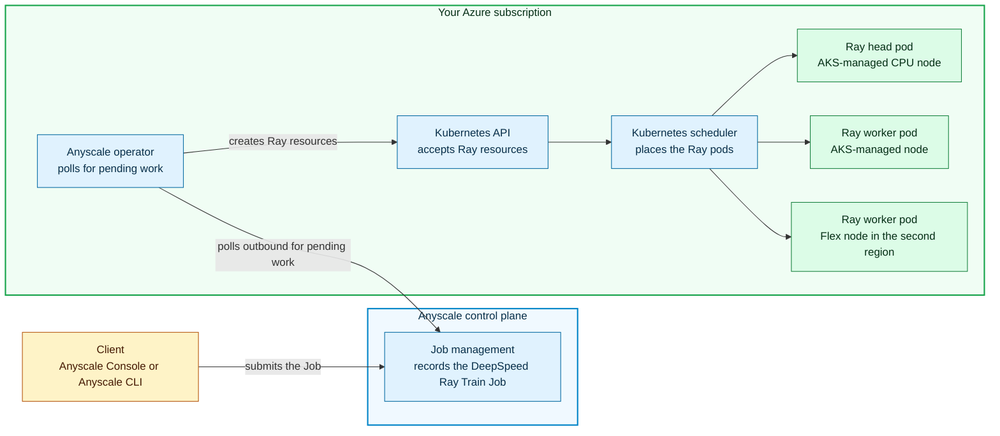

This lab combines four technologies to run one Ray workload on compute in two
Azure regions. AKS manages nodes in the cluster's region, while AKS Flex Node
joins a separately managed VM from a second region to the same cluster. This
layout models a broader pattern in which the additional CPU or GPU machine could
instead run on-premises or in another cloud.

You do not need prior experience with these technologies, but the later modules
assume you know what each one does. Read this page first, then use it as a
reference when a module mentions a Ray head, a Flex node, or a compute config.

## Ray, in brief

[Ray](https://github.com/ray-project/ray) is an open-source framework for
scaling Python and AI applications from one machine to a cluster. Its distributed
runtime schedules work across the cluster, and its libraries provide higher-level
tools for tasks such as model training.

A running Ray cluster has two kinds of members:

| Member | What it does | Where it runs in this lab |
| --- | --- | --- |
| Ray head | Coordinates the cluster. It tracks cluster state and hands work to the workers. There is exactly one. | A [pod](https://kubernetes.io/docs/concepts/workloads/pods/) on an AKS-managed CPU node |
| Ray worker | Runs the training function. There can be many. | Both modes use one managed AKS worker in Region A and one Flex worker in Region B. CPU mode uses CPU nodes; GPU mode uses GPU nodes. |

Both workload paths use the same two-region shape. The Ray head runs on an
AKS-managed CPU node. One training worker runs on managed AKS in Region A, and
the other runs on Flex in Region B. CPU mode uses CPU workers; GPU mode uses GPU
workers.

This lab uses [**Ray Train**](https://docs.ray.io/en/latest/train/train.html),
Ray's library for distributed model training. Ray Train defines a worker as a
process that runs the training function. Its `ScalingConfig` starts two workers
for both CPU and GPU runs in this lab.

Each worker has a **world rank**, a unique number within that training run, and
the **world size** is the total number of workers. Both modes have world size 2,
with ranks 0 and 1. DeepSpeed coordinates distributed optimization between those
two processes. A completed record from each rank proves that both worker
processes ran the training function. Module 6 combines those records with
Kubernetes pod placement, which proves that the processes ran in the two
regions.

The workload also uses [**DeepSpeed**](https://github.com/deepspeedai/DeepSpeed)
to train with less GPU memory. Its [ZeRO stage 2](https://www.deepspeed.ai/tutorials/zero/)
feature divides some of the training information that would otherwise be copied
onto every GPU, such as the model's learning progress and calculated updates
(optimizer states and gradients).

The workflow you perform in this lab is a small, repeatable version of an AI/ML
practitioner's distributed model-training workflow. You prepare the compute,
submit a training job, let Ray Train and DeepSpeed coordinate the workers, and
inspect the training result and worker placement. These are the same broad steps
a practitioner follows when training or fine-tuning a language model.

For the training job, the script creates a tiny GPT-2-style model, generates
token sequences in the same shape as model input, and sends batches to the Ray
Train workers. Each worker performs real training steps: the model predicts the
next token, measures how wrong the prediction was (the loss), and adjusts its
internal weights. DeepSpeed handles the distributed updates and GPU memory use.

Unlike a real fine-tuning project, this lab does not start with a pretrained
model or meaningful training data. A practitioner would usually use a pretrained
model, carefully prepared text, many more training steps, evaluation, and saved
model checkpoints. This lab uses a small model, generated inputs, and four
training steps so the run is quick and repeatable. It proves that the distributed
training system works across AKS and Flex; it does not produce a useful trained
model.

:::info Why Module 6 records training and placement
The workload summary shows that each Ray Train worker completed part of the
DeepSpeed training run. Kubernetes placement data shows which node and Azure
region hosted each worker pod. Module 6 joins those two records so you can see
one managed AKS worker in Region A and one Flex worker in Region B. Together,
those records demonstrate one Ray training workload using compute in two Azure
regions.
:::

## AKS Flex Node

Normally, every node in an AKS cluster comes from an AKS managed node pool, and
Azure creates and manages those machines for you.

[**AKS Flex Node**](https://github.com/Azure/AKSFlexNode) removes that
constraint. It lets a Linux virtual machine or bare-metal host **outside**
standard AKS node pools join the cluster as a worker node. You supply the machine
and keep control of its lifecycle. Flex Node installs an agent on it and joins it
to your cluster.

After it joins, it behaves like any other Kubernetes
[node](https://kubernetes.io/docs/concepts/architecture/nodes/): it shows up in
`kubectl get nodes`, and the
[Kubernetes scheduler](https://kubernetes.io/docs/concepts/scheduling-eviction/kube-scheduler/)
can place pods on it.

In this lab, the Flex machine is an Azure VM that you create in a second region,
which is why the lab can prove a workload running in two places at once. The same
Flex Node concepts apply when the added machine runs in a datacenter or another
cloud, as long as it can reach the AKS cluster over the network. This lab builds
and validates only the Azure multi-region implementation.

## Anyscale on Azure

[Anyscale on Azure](https://learn.microsoft.com/en-us/azure/anyscale-on-azure/)
is a managed Ray platform that runs on your AKS cluster. You submit a workload to
the Anyscale control plane, while the Ray head, workers, and application data run
in your Azure subscription.

Three Anyscale terms appear in the modules:

| Term | What it means |
| --- | --- |
| [Cloud](https://docs.anyscale.com/clouds) | Anyscale's logical connection to the infrastructure where it can create Ray clusters. In this lab, the cloud connects the Anyscale control plane to your AKS cluster and records the Azure storage, identity, and networking settings that workloads use. |
| [Compute config](https://docs.anyscale.com/configuration/compute) | An Anyscale configuration that defines the shape of a Ray cluster. It describes the head and worker groups, their CPU, memory, and GPU requirements, how many workers can run, and the Kubernetes node selectors used for placement. This is an Anyscale concept built on Ray cluster configuration. |
| [Job](https://docs.anyscale.com/jobs) | A finite, submitted execution of your Ray application. The Job identifies the Python entry point and cluster configuration, starts the application, and records its state, logs, and result. Anyscale creates the Ray cluster for the Job and terminates it when the run finishes. |

A Ray application is the Python program that uses Ray to distribute work. A Job
is the managed execution of that program. In this lab, the application is the
training script, while the Anyscale Job supplies its command, image, compute
config, lifecycle state, and logs.

Anyscale runs a [**Kubernetes operator**](https://learn.microsoft.com/en-us/azure/anyscale-on-azure/architecture#kubernetes-operator-model)
inside your AKS cluster, in the `anyscale-operator`
[namespace](https://kubernetes.io/docs/concepts/overview/working-with-objects/namespaces/).
When you submit a Job through the Anyscale console or CLI, the control plane
records a pending operation. The operator polls the control plane for those
operations over an outbound connection, then creates and manages the Ray pods
and services through the
[Kubernetes API](https://kubernetes.io/docs/concepts/overview/kubernetes-api/).
The control plane does not open an inbound connection to your AKS cluster. See
[Anyscale on Azure networking](https://learn.microsoft.com/en-us/azure/anyscale-on-azure/networking#operator-and-ray-cluster-communication)
for the documented traffic flow.

After the Flex machine joins AKS and reports as a Ready node, Kubernetes can
place a Ray worker pod there when the compute config's resource requirements and
node selector match it. The same Python training function runs whether its
worker pod lands on an AKS-managed node or the Flex node.

## Unbounded, the pod network

Kubernetes gives every pod an IP address, and something has to provide that
addressing and carry traffic between pods. A
[Container Network Interface (CNI) plugin](https://kubernetes.io/docs/concepts/cluster-administration/networking/#how-to-implement-the-kubernetes-network-model)
normally performs that job. In this lab, AKS is created with
`networkPlugin=none`, so AKS does not install a CNI plugin for you.

[**Unbounded Kubernetes**](https://github.com/Azure/unbounded) extends a
Kubernetes cluster so that worker nodes in different locations can share one pod
and service network. Its `unbounded-net` component is a CNI plugin and multi-site
networking system for cross-site pod connectivity. In this lab, it assigns pod
address ranges to the managed AKS and Flex sites, then carries pod traffic
between the two Azure regions over their peered virtual networks. This network
lets a Ray worker on the Flex node communicate with the Ray head and the other
worker pods.

In Module 2, you use Terraform to install Unbounded for the AKS-managed nodes and
create the network path to the second region. In Module 3, you extend that pod
network to the Flex node, then run test pods to verify pod addresses, DNS, HTTPS,
and two-way traffic across the two sites. The lab scripts generate the
configuration from the Terraform values you set in Module 1.

## How the pieces fit together

The diagram shows the two worker locations used by both modes. CPU mode uses CPU
workers, while GPU mode uses GPU workers.

<!-- Keep this diagram in sync with assets/architecture/00-key-concepts-flow.mmd. -->

From the Anyscale Console or CLI, you submit an Anyscale Job that runs this
lab's DeepSpeed Ray Train script. Job management in the Anyscale control plane
records the request. The operator in your Azure subscription polls the control
plane over an outbound connection, retrieves the pending work, and creates the
Ray resources in AKS. The Kubernetes scheduler then matches each pod's resource
requirements and node selector to an eligible node. Both modes place one worker
on managed AKS in Region A and one on Flex in Region B. The selected mode
determines whether those workers request CPU or GPU capacity.

## Terms you will see in commands

| Term | Meaning in this lab |
| --- | --- |
| Region A | The Azure region you assign to `TF_VAR_azure_location` in your Module 1 environment file. Terraform deploys the AKS cluster and its managed node pools there. |
| Region B | The second Azure region you assign to `TF_VAR_flex_region` in Module 1. Terraform deploys the Flex VM and its virtual network there. |
| [Node pool](https://learn.microsoft.com/en-us/azure/aks/create-node-pools) | A group of AKS nodes with the same configuration. This lab uses the `sys` pool for system pods, the `cpu` pool for the Ray head, and an optional GPU pool for a GPU worker. |
| `agentpool=aksflexnodes` | A Kubernetes [label](https://kubernetes.io/docs/concepts/overview/working-with-objects/labels/) on the Flex node. The compute config uses a [node selector](https://kubernetes.io/docs/concepts/scheduling-eviction/assign-pod-node/#nodeselector) with this key and value so Kubernetes places the Flex worker pod there. |
| [Gateway](https://kubernetes.io/docs/concepts/services-networking/gateway/) | The Kubernetes API resource that provides an entry point to the Ray services Anyscale creates in this lab. |
| Workload summary | The JSON file the training run writes, recording what each worker did. |

## Next step

Proceed to **[Module 1: Prepare Your Environment](/docs/ai-workloads-on-aks/module-01-environment-setup)**.
