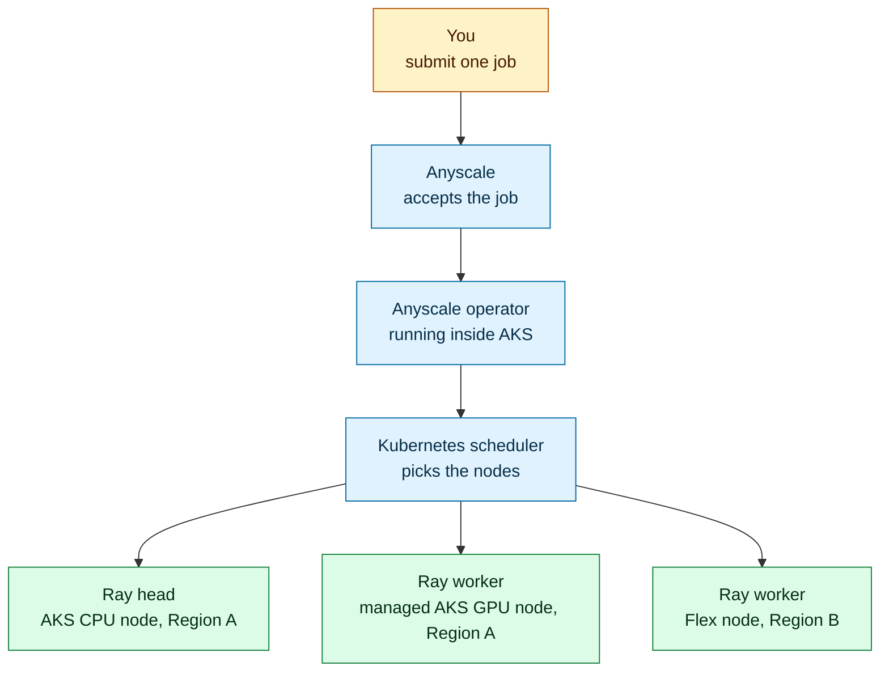

This lab combines four technologies. You do not need prior experience with any
of them, but the later modules assume you know what each one does. Read this page
first, then use it as a reference when a module mentions a Ray head, a Flex node,
or a compute config.

## Ray, in brief

Ray is an open-source framework for running Python across many machines. You
write ordinary Python, and Ray distributes the work.

A running Ray cluster has two kinds of members:

| Member | What it does | Where it runs in this lab |
| --- | --- | --- |
| Ray head | Coordinates the cluster. It tracks cluster state and hands work to the workers. There is exactly one. | An AKS CPU node in Region A |
| Ray worker | Runs the actual computation. There can be many. | The Flex node, and in GPU mode also a managed AKS GPU node |

This lab uses **Ray Train**, the Ray library for distributed model training. Ray
Train starts one process per worker and gives each one a **rank**, which is just
its index in the training group. A two-worker run has rank 0 and rank 1. The
ranks train together on the same job and exchange updates as they go, so a result
that shows two ranks is evidence that both machines did real work.

The workload also uses **DeepSpeed**, a library that makes model training use
memory more efficiently. You do not configure it directly in this lab.

:::info Why the head and workers matter later
Module 6 checks that the head landed on an AKS CPU node while the workers landed
on two different GPU machines. That split is the point of the lab, so the terms
appear throughout the results.
:::

## AKS Flex Node

Normally, every node in an AKS cluster comes from an AKS managed node pool, and
Azure creates and manages those machines for you.

**AKS Flex Node** relaxes that rule. It lets a Linux machine that AKS did not
create join the cluster as a worker node. You supply the machine and keep control
of its lifecycle. Flex Node installs an agent on it and joins it to your cluster.

After it joins, it behaves like any other Kubernetes node: it shows up in
`kubectl get nodes`, and the Kubernetes scheduler can place pods on it.

In this lab, the Flex machine is an Azure VM that you create in a second region,
which is why the lab can prove a workload running in two places at once. The same
approach applies to a machine in a datacenter or another cloud, as long as it can
reach the cluster over the network. This lab only builds and validates the Azure
case.

## Anyscale on Azure

Anyscale is a managed platform for running Ray. Instead of building and operating
a Ray cluster yourself, you submit work and Anyscale creates the Ray head and
workers for you.

Three Anyscale terms appear in the modules:

| Term | What it means |
| --- | --- |
| Cloud | The registered target Anyscale deploys into. Here it points at your AKS cluster along with its storage and identity settings. |
| Compute config | A declaration of what a run needs: CPU, memory, GPUs, and which nodes the pods may use. |
| Job | One submitted run of your workload. It has a name, a state such as `RUNNING` or `SUCCEEDED`, and logs. |

Anyscale runs an **operator** inside your AKS cluster, in the
`anyscale-operator` namespace. When you submit a Job, Anyscale sends it to that
operator, and the operator creates the Ray pods through the normal Kubernetes
API. Because the Flex machine is an ordinary Kubernetes node by that point,
Anyscale can schedule a Ray worker onto it without any change to your workload
code.

## Unbounded, the pod network

Kubernetes gives every pod an IP address, and something has to provide that
addressing and carry traffic between pods. In this lab, AKS is created with
`networkPlugin=none`, which means AKS does not install its usual pod network.

**Unbounded** fills that role instead. It assigns pod address ranges to both the
managed AKS nodes and the Flex node, and it carries pod traffic between the two
regions over the peered Azure networks. This is what allows a Ray worker on the
Flex node to talk to the Ray head in the other region.

You install it through Terraform in Module 2 and verify it in Module 3. You do
not need to configure it by hand.

## How the pieces fit together

Reading that top to bottom: you submit one job, Anyscale hands it to the operator
in your cluster, Kubernetes places the pods, and the training runs on machines in
two regions at once.

## Terms you will see in commands

| Term | Meaning in this lab |
| --- | --- |
| Region A | Where the AKS cluster runs. You set its real Azure name in Module 1. |
| Region B | Where the Flex machine runs. You set its real Azure name in Module 1. |
| Node pool | A group of AKS nodes with the same size and role. This lab uses `sys` for system pods and `cpu` for the Ray head. |
| `agentpool=aksflexnodes` | The label this lab puts on the Flex node so workloads can target it. |
| Gateway | The Kubernetes entry point Anyscale uses to reach Ray services. |
| Workload summary | The JSON file the training run writes, recording what each worker did. |

## Next step

Proceed to **[Module 1: Prepare Your Environment](/docs/ai-workloads-on-aks/module-01-environment-setup)**.
