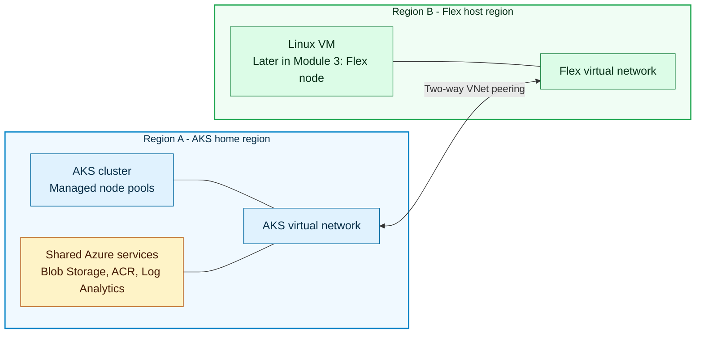

import Cleanup from "../../src/components/SharedMarkdown/_cleanup.mdx";

In this module, one Terraform apply creates all the infrastructure the lab
needs. **Region A** contains the AKS cluster and its supporting Azure services.
**Region B** contains a Linux virtual machine (VM). Later in Module 3, you join
that VM to AKS as the Flex node.

## What You Will Do

Terraform creates these resources for you:

- An **AKS cluster in Region A** to coordinate and run the workload.
- A **Linux VM in Region B**. Later in Module 3, it becomes the Flex node.
- An **[Azure Container Registry (ACR)](https://learn.microsoft.com/en-us/azure/container-registry/container-registry-intro)**
  that Anyscale registers as the cloud's
  image registry and AKS is authorized to pull images from.
- An **[Azure Storage account](https://learn.microsoft.com/en-us/azure/storage/blobs/storage-blobs-introduction)**
  that Anyscale uses for cloud storage. Later in
  Module 6, the training job also writes its result summary there.
- **[Log Analytics](https://learn.microsoft.com/en-us/azure/azure-monitor/logs/log-analytics-workspace-overview)
  and [Container Insights](https://learn.microsoft.com/en-us/azure/azure-monitor/containers/container-insights-overview)**
  to collect AKS container logs,
  metrics, and Azure resource diagnostics.
- Two **[peered virtual networks (VNets)](https://learn.microsoft.com/en-us/azure/virtual-network/virtual-network-peering-overview)**
  that give the AKS nodes and Flex VM a
  private cross-region path to each other's Azure network addresses.

After Terraform finishes, you connect `kubectl` to AKS and verify the cluster,
pod network, and VNet peering. These checks prove that the foundation is ready
before you turn the VM into a Flex node.

## Architecture overview

<!-- Keep this diagram in sync with assets/architecture/02-aks-foundation.mmd. -->



Terraform creates both directions of the VNet peering before it creates the
Flex VM. It also confirms that AKS responds and that its pod network is ready.
Only then does Terraform create and start the VM in Region B.

AKS uses `networkPlugin=none`, which means AKS does not install a Container
Network Interface
([CNI](https://kubernetes.io/docs/concepts/extend-kubernetes/compute-storage-net/network-plugins/))
plugin. Terraform installs [Unbounded](https://github.com/Azure/unbounded) as
the CNI for the managed AKS nodes and assigns their pod addresses from
`TF_VAR_aks_pod_cidr`.

Terraform gives the VM's managed identity permission to register the machine
with AKS.

Later in Module 3, you join the VM to AKS and extend Unbounded to it. Unbounded
assigns Flex pod addresses from `TF_VAR_unbounded_flex_pod_cidr`.

The peered VNets carry node and pod traffic between the regions over private
Azure addresses. The VM separately reaches the public AKS API over HTTPS when
it joins the cluster.

:::info Why this lab uses VNet peering
VNet peering fits this lab because AKS and the Flex VM both run in Azure. Think
of peering as a private road between their two Azure networks.

If the Flex node ran on-premises or in another cloud, Azure VNet peering could
not reach that network. You would provide the private road with
[Azure ExpressRoute](https://learn.microsoft.com/azure/expressroute/expressroute-introduction)
or a
[site-to-site VPN](https://learn.microsoft.com/azure/vpn-gateway/vpn-gateway-about-vpngateways)
instead. Unbounded would carry Kubernetes pod traffic across that connection
and could use an encrypted WireGuard tunnel when needed. The connection method
changes, but AKS and the Flex node still need a reliable network path between
them.
:::

## Step 1: Review your deployment settings

The project, environment label, regions, sizing, and Anyscale setting are already
in `.env`. For a repeat run, confirm that the environment label does not belong
to an existing lab resource group. Keep Anyscale disabled while Terraform builds
the AKS foundation:

```bash
grep -E '^TF_VAR_(project|environment|azure_location|region_short|flex_region|flex_region_short|anyscale_enabled)=' .env
```

For the West US 2 and South Central US example from Module 1, the active
assignments are:

```text
TF_VAR_project="flexany"
TF_VAR_environment="dev"
TF_VAR_azure_location="westus2"
TF_VAR_region_short="wus2"
TF_VAR_flex_region="southcentralus"
TF_VAR_flex_region_short="scus"
TF_VAR_anyscale_enabled="false"
```

Your environment and region values can differ, but `TF_VAR_anyscale_enabled`
must remain `"false"` for this module.

:::info Using a fallback region
If AKS capacity in Region A is unavailable, choose another Anyscale-supported AKS
location and rerun Module 1's `sku-options` command with Region A and Region B.
Save the new region pair and one shared worker SKU in a separate environment
file, then run with
`ANYSCALE_AKS_ENV_FILE=.env.my-fallback ./scripts/anyscale-aks.sh apply`.
:::

## Step 2: Preview the Azure resources

```bash
./scripts/anyscale-aks.sh plan
```

Example output:

```text
Terraform will perform the following actions:
  # module.aks.azurerm_kubernetes_cluster.this will be created
  # module.network.azurerm_virtual_network.this will be created
  # azurerm_virtual_network.flex will be created

Plan: <resource-count> to add, 0 to change, 0 to destroy.
```

This command prepares the Terraform values, checks the configuration, and creates
a plan file. Review the output before continuing. Resource totals can change
between versions. On a clean deployment, every planned action must be a create
and the summary must show `0 to change, 0 to destroy`.

## Step 3: Create the AKS foundation

```bash
./scripts/anyscale-aks.sh apply
```

Expected duration: **15-25 minutes** (AKS cluster creation is the longest step).
Terraform prints resource progress while Azure creates the cluster. Wait for the
apply to finish, then use the node, network profile, and VNet peering checks
below as the evidence that the foundation is ready.

When complete, Terraform prints the AKS and network details. Later in Module 3,
you use these values to connect the Flex node:

```text
Outputs:
  aks_cluster_name = "aks-flexany-dev-<region-a-short>"
  aks_api_server_fqdn = "aks-flexany-dev-<region-a-short>-xxxxx.hcp.<region-a>.azmk8s.io"
  flex_vnet_id = "/subscriptions/.../vnet-flexany-dev-<region-b-short>"
  flex_host_vm_name = "vm-flex-flexany-dev-<region-b-short>"
```

:::caution Before you connect the Flex node
Continue only after AKS is running and both VNet peerings report `Connected` and
`Succeeded`. Later in Module 3, the Flex host uses that network path when it
joins the cluster.
:::

## Step 4: Connect kubectl to the cluster

`kubectl` is the Kubernetes command-line tool, and it needs credentials before it
can talk to your new cluster. This command fetches them and stores them in your
[kubeconfig](https://kubernetes.io/docs/concepts/configuration/organize-cluster-access-kubeconfig/),
the local file that holds cluster connection details.

```bash
source .env
RG="rg-${TF_VAR_project}-${TF_VAR_environment}-${TF_VAR_region_short}"
CLUSTER="aks-${TF_VAR_project}-${TF_VAR_environment}-${TF_VAR_region_short}"

az aks get-credentials \
  --resource-group "$RG" \
  --name "$CLUSTER" \
  --overwrite-existing
```

Example output:

```text
Merged "aks-flexany-dev-<region-a-short>" as current context in /Users/operator/.kube/config
```

## Step 5: Check cluster health

```bash
kubectl get nodes -o wide
kubectl get pods -n kube-system
```

Expected output:

```text
NAME                                STATUS   ROLES   AGE   VERSION   INTERNAL-IP
<system-node-name>                  Ready    agent   <age> <version> <private-ip>
<cpu-node-name>                     Ready    agent   <age> <version> <private-ip>

NAME                                  READY   STATUS    RESTARTS   AGE
coredns-6d8f9d9b9f-abcde              1/1     Running   0          10m
konnectivity-agent-7c6d8dbf9f-fghij   1/1     Running   0          10m
kube-proxy-abcde                      1/1     Running   0          10m
```

You should see one or more `sys` nodes and at least one `cpu` node in `Ready`
state. The CPU pool starts with `min_count=1` and can scale to four nodes. The CPU
profile does not create an AKS GPU pool. The GPU profile also shows the single
managed GPU node configured in `TF_VAR_gpu_pool_configs`. AKS can scale the
system pool and run additional system pods that are not shown in the example.

## Step 6: Verify the AKS pod-networking foundation

Terraform creates the AKS cluster with `networkPlugin=none` before the Flex host
joins. Check the live network profile and node health before you provision the
Flex host. These two commands together show that Unbounded, not an AKS-managed
plugin, provides pod networking:

1. The AKS network profile confirms that the cluster is intentionally running
   without the AKS-managed pod network path.
2. The node list confirms that the managed nodes are healthy and that each one
   received a pod address range from Unbounded.

```bash
source .env
RG="rg-${TF_VAR_project}-${TF_VAR_environment}-${TF_VAR_region_short}"
CLUSTER="aks-${TF_VAR_project}-${TF_VAR_environment}-${TF_VAR_region_short}"

az aks show \
  --resource-group "$RG" \
  --name "$CLUSTER" \
  --query 'networkProfile.{plugin:networkPlugin,serviceCidr:serviceCidr,podCidr:podCidr}' \
  -o json

kubectl get nodes \
  -o custom-columns='NAME:.metadata.name,STATUS:.status.conditions[?(@.type=="Ready")].status,POD-CIDR:.spec.podCIDR'
```

Expected network profile:

```json
{
  "plugin": "none",
  "serviceCidr": "10.100.0.0/16",
  "podCidr": "<AKS control-plane value or null>"
}
```

The `plugin` value must be `none`. AKS can still report a cluster-level
`podCidr`; Unbounded does not use that value to select each node's range. The
node list must show `True` in `STATUS` and one `/24` from
`TF_VAR_aks_pod_cidr` in `POD-CIDR` for every managed node. Keep the network
profile and node output; together they confirm that Unbounded owns managed-node
pod networking. Later in Module 3, you add the Flex node to this network.

## Step 7: Verify the cross-region network connection

```bash
source .env
RG="rg-${TF_VAR_project}-${TF_VAR_environment}-${TF_VAR_region_short}"
AKS_VNET="vnet-${TF_VAR_project}-${TF_VAR_environment}-${TF_VAR_region_short}"
FLEX_VNET="vnet-${TF_VAR_project}-${TF_VAR_environment}-${TF_VAR_flex_region_short}"

az network vnet peering list \
  --resource-group "$RG" \
  --vnet-name "$AKS_VNET" \
  -o table

az network vnet peering list \
  --resource-group "$RG" \
  --vnet-name "$FLEX_VNET" \
  -o table
```

Expected fields:

```text
Name         ResourceGroup          PeeringState    ProvisioningState
-----------  ---------------------  --------------  -------------------
aks-to-flex  <resource-group>       Connected       Succeeded
flex-to-aks  <resource-group>       Connected       Succeeded
```

Terraform creates both directions. Both `aks-to-flex` and `flex-to-aks` must show
`PeeringState=Connected` and `ProvisioningState=Succeeded`. Do not continue while
either direction is disconnected, failed, or still provisioning. Later in
Module 3, the Flex VM uses this network path when it joins AKS.

## Troubleshooting

### The Terraform apply was interrupted

Terraform can continue an interrupted deployment when its state is readable.
Inspect the state first, then regenerate the plan before you retry the apply:

```bash
terraform -chdir=infra/terraform state list
./scripts/anyscale-aks.sh plan
./scripts/anyscale-aks.sh apply
```

The plan should show only the work that remains. Do not delete the resource
group or state file when `terraform state list` prints managed resources.

If the state command fails and `infra/terraform/terraform.tfstate` is zero bytes,
do not treat that failure as an empty deployment. Check the target resource
group directly:

```bash
source .env
RG="rg-${TF_VAR_project}-${TF_VAR_environment}-${TF_VAR_region_short}"

wc -c infra/terraform/terraform.tfstate
az resource list --resource-group "$RG" \
  --query '[].{Name:name,Type:type}' \
  -o table
```

If Azure lists any resource, stop and preserve the state files while you
reconcile that resource. If the table has no rows and `wc -c` reports `0`, the
interruption happened before Terraform recorded or created a resource. Delete
only the empty resource group and zero-byte state file, then rerun the plan:

```bash
az group delete --name "$RG" --yes
az group wait --name "$RG" --deleted

if [[ -f infra/terraform/terraform.tfstate && \
      ! -s infra/terraform/terraform.tfstate ]]; then
  rm infra/terraform/terraform.tfstate
fi

./scripts/anyscale-aks.sh plan
```

The recovery is complete when the plan succeeds and contains only the expected
create actions for this lab.

## Validate the AKS foundation

You can move on when the `sys` node pool is `Ready`, the cluster profile shows
`networkPlugin=none`, and both VNet peerings show `Succeeded`. Keep the network
profile, node list, and peering output. Together, they show that Unbounded
provides pod networking and that the cross-region network path is live. Later in
Module 3, you use this foundation to join the Flex host.

## Next step

Proceed to **[Module 3: Connect a Flex Node](/docs/ai-workloads-on-aks/module-03-flex-node)**.

<Cleanup />
