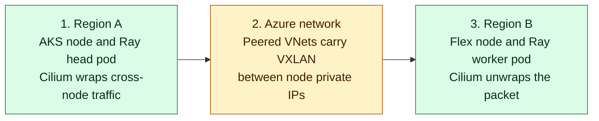

In this setup, you will create a Linux VM in **Region B** and join it to the AKS
cluster in **Region A** as an AKS Flex node. Cilium and Envoy run on that node,
giving its pods addresses and a network path to pods on the AKS node pools.

## What You Will Do

You will verify the no-CNI AKS profile, enable the Flex host, generate a join
configuration from the current stable AKS Flex Node release, and bootstrap the
host. You will then schedule test pods and confirm Cilium networking, DNS, HTTPS
access, and traffic between the AKS and Flex nodes before connecting Anyscale.

## How Flex networking works

AKS Flex Node prepares the external machine and joins it to AKS as a worker. It
does not provide the pod network. This lab installs Cilium on every AKS and Flex
node to allocate pod addresses, route pod traffic, and implement Kubernetes
services.

The diagram follows one packet between pods on different nodes. Cilium wraps the
packet in VXLAN, Azure routes that wrapped packet between the nodes' private IP
addresses over VNet peering, and Cilium on the destination node unwraps it.
Traffic between pods on the same node does not need the VXLAN step.

<!-- Keep this diagram in sync with assets/architecture/02-flex-networking.mmd. -->

<div className="network-explainer">
<div className="network-diagram">



</div>
<aside className="translation-bubble">
  <strong>Put simply, this means:</strong>
  <p>Flex Node joins the machine to AKS. Cilium carries pod traffic between nodes in Region A and Region B.</p>
</aside>
</div>

The same Cilium network also supports the services the workload expects:

| Workload need | What happens |
| --- | --- |
| Pod addresses | Cluster-pool IPAM gives each node a block from `10.83.0.0/16`, then Cilium assigns addresses from that block to its pods. |
| Kubernetes names and services | Flex pods use normal `ClusterFirst` DNS. Cilium's eBPF service handling routes ClusterIP traffic without kube-proxy. |
| External HTTPS | Cilium forwards Flex pod traffic through the Flex host's normal Azure network path. The lab verifies HTTPS access to Anyscale. |

The Flex host reaches the public AKS API over HTTPS to join the cluster and
report node state. That control-plane connection is separate from the VXLAN pod
path. Step 5 checks the Cilium settings, DNS, ClusterIP routing, cross-node pod
traffic, and external HTTPS with short-lived pods.

## Step 1: Check the AKS network profile

The cluster must have no built-in CNI so the installed upstream Cilium release
can configure both AKS and Flex nodes. Read the live profile before enabling the
Flex host:

```bash
source .env
RESOURCE_GROUP="rg-${TF_VAR_project}-${TF_VAR_environment}-${TF_VAR_region_short}"
CLUSTER_NAME="aks-${TF_VAR_project}-${TF_VAR_environment}-${TF_VAR_region_short}"

az aks show \
  --resource-group "$RESOURCE_GROUP" \
  --name "$CLUSTER_NAME" \
  --query 'networkProfile.{plugin:networkPlugin,podCidr:podCidr,serviceCidr:serviceCidr}' \
  -o json
```

The foundation prints the Cilium cluster-pool range:

```json
{
  "plugin": "none",
  "podCidr": "10.83.0.0/16",
  "serviceCidr": "10.100.0.0/16"
}
```

The `podCidr` value must equal `TF_VAR_cilium_pod_cidr` in `.env`. It is the
range Cilium allocates across both locations.

## Step 2: Enable the Flex host

The upstream AKS Flex Node Cilium lab validates Ubuntu 24.04. Check that your CPU
profile uses that image, then enable the host in `.env`:

```bash
grep '^TF_VAR_flex_host_source_image_reference=' .env
TF_VAR_flex_host_enabled="true"
```

For the CPU path, the image line must include `Canonical`, `ubuntu-24_04-lts`,
and `server`. For the GPU path, use the image reference you configured in `.env`
during environment setup. A GPU-ready image includes the NVIDIA drivers for the
selected VM; Module 5 installs the Kubernetes device plugin that advertises that
GPU to workloads.

Then create the VM and its peered network attachment:

```bash
./scripts/anyscale-aks.sh apply
```

Terraform creates a `vm-flex-...` host in Region B. It does not allocate
secondary pod IPs. Cilium assigns worker pod addresses from the Cilium pool after
the node joins.

## Step 3: Generate the Flex join configuration

Generate the configuration after the VM exists:

```bash
./scripts/anyscale-aks.sh flex-config
```

This command finds the current stable AKS Flex Node release, downloads the
matching configuration tool, creates a bootstrap token, and saves the join
configuration at `.cache/flex/aks-flex-node-config.json`.

Expected output includes:

```text
AKS Flex Node stable release: v<latest>
generated: <repository-path>/.cache/flex/aks-flex-node-config.json
```

## Step 4: Bootstrap the Flex host

```bash
./scripts/anyscale-aks.sh flex-bootstrap
```

This command copies the configuration to the VM, verifies the downloaded archive,
starts AKS Flex Node, applies the required Kubernetes labels and taint, and
approves the Flex node certificate request.

## Step 5: Verify the Flex workload network

After the node reports `Ready`, run the networking checks:

```bash
./scripts/validate-lab.sh m3
```

Expected output includes:

```text
PASS M3-01/M3-02 Flex VM exists and is running
PASS M3-03/M3-04 Flex node joined and Ready
PASS M3-05 Flex host runs Ubuntu 24.04
PASS Unmanaged upstream Cilium cluster-pool IPAM and VXLAN ready
PASS Cilium agent and Envoy Ready on Flex node <flex-node-name>
PASS Flex ClusterFirst DNS resolves Anyscale and Kubernetes service names
PASS Flex pod HTTPS egress reaches console.azure.anyscale.com
PASS Upstream Cilium connectivity: AKS and Flex pods exchanged traffic and AKS reached Flex ClusterIP <service-ip>:8080
```

## Results to keep

The networking command saves its detailed results under
`.cache/lab-validation/m3-flex-network/`. Keep these files if you need to compare
pod networking or host details later:

| Result | What it shows |
| --- | --- |
| `flex-host-runtime.json` | The Flex VM runs the Ubuntu 24.04 host image required by the upstream Cilium scenario and records its kernel version. |
| `aks-network-profile.json` and `cilium-values-runtime.json` | AKS has no built-in CNI and Cilium uses cluster-pool IPAM, VXLAN, and kube-proxy replacement. |
| `cilium-flex-pods-runtime.json` | Cilium agent and Envoy run on the Flex node. |
| DNS, egress, and route pod logs | A Flex pod resolved Kubernetes names, reached HTTPS, and exchanged traffic with an AKS pod. |

## Next step

Proceed to [Module 4: Connect Anyscale to AKS](./module-04-anyscale-binding).
