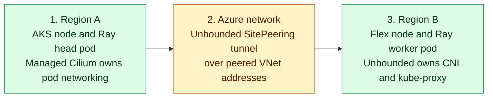

Module 2 created a Linux VM in **Region B**. You will now join it to the AKS
cluster in **Region A** as an AKS Flex node. Unbounded owns CNI and kube-proxy
on that node, while Azure CNI Overlay powered by managed Cilium remains the CNI
for AKS-managed nodes.

## What You Will Do

You will verify the managed AKS network profile, inspect the provisioned Flex
VM, generate a join configuration from the current stable AKS Flex Node release,
and bootstrap the host. You will then schedule test pods and confirm Unbounded
ownership, DNS, HTTPS access, and bilateral traffic between AKS and Flex before
connecting Anyscale.

## How Flex networking works

AKS Flex Node prepares the external machine and joins it to AKS as a worker. It
does not provide the pod network. Managed Cilium allocates addresses and handles
services on AKS nodes. Unbounded v0.2.2 allocates Flex pod addresses, runs
kube-proxy only on Flex, and creates a direct `SitePeering` between the
`aks-managed` and `flex` sites.

The diagram follows one packet between sites. Unbounded discovers the managed
AKS node pod `/24`s and the Flex node pod block, then uses its automatically
selected tunnel protocol to carry traffic over the nodes' private IP addresses
and VNet peering.

<!-- Keep this diagram in sync with assets/architecture/02-flex-networking.mmd. -->

<div className="network-explainer">
<div className="network-diagram">



</div>
<aside className="translation-bubble">
  <strong>Put simply, this means:</strong>
  <p>Flex Node joins the machine to AKS. Unbounded connects its Flex pod network to the managed AKS pod network.</p>
</aside>
</div>

The mixed-CNI network supports the services the workload expects:

| Workload need | What happens |
| --- | --- |
| Pod addresses | Azure CNI Overlay assigns AKS pods from `TF_VAR_cilium_pod_cidr`. Unbounded assigns the Flex node a `/24` from `TF_VAR_unbounded_flex_pod_cidr`. |
| Kubernetes names and services | Flex pods use normal `ClusterFirst` DNS. Unbounded-managed kube-proxy handles ClusterIP traffic on Flex; managed Cilium handles it on AKS. |
| External HTTPS | Flex pods leave through the Flex host's Azure network path. The lab verifies HTTPS access to Anyscale. |

The Flex host reaches the public AKS API over HTTPS to join the cluster and
report node state. That control-plane connection is separate from the pod
tunnel. Step 5 checks CNI ownership, DNS, bilateral ClusterIP routing,
cross-site pod traffic, and external HTTPS with short-lived pods.

## Step 1: Check the AKS network profile

The AKS-managed nodes must use Azure CNI Overlay powered by Cilium before
Unbounded adds the separate Flex network. Read the live profile before enabling
the Flex host:

```bash
source .env
RESOURCE_GROUP="rg-${TF_VAR_project}-${TF_VAR_environment}-${TF_VAR_region_short}"
CLUSTER_NAME="aks-${TF_VAR_project}-${TF_VAR_environment}-${TF_VAR_region_short}"

az aks show \
  --resource-group "$RESOURCE_GROUP" \
  --name "$CLUSTER_NAME" \
  --query 'networkProfile.{plugin:networkPlugin,mode:networkPluginMode,dataPlane:networkDataplane,podCidr:podCidr,serviceCidr:serviceCidr}' \
  -o json
```

The foundation prints the managed Azure overlay range:

```json
{
  "dataPlane": "cilium",
  "mode": "overlay",
  "plugin": "azure",
  "podCidr": "10.83.0.0/16",
  "serviceCidr": "10.100.0.0/16"
}
```

The `podCidr` value must equal `TF_VAR_cilium_pod_cidr` in `.env`. It is the
managed AKS pod range. `TF_VAR_unbounded_flex_pod_cidr` is the separate Flex
pod range.

## Step 2: Check the provisioned Flex host

This lab validates the CPU Flex path on Ubuntu 24.04. Check the selected host
image and the VM name created in Module 2:

```bash
grep '^TF_VAR_flex_host_source_image_reference=' .env
./scripts/anyscale-aks.sh output -raw flex_host_vm_name
```

For the CPU path, the image line must include `Canonical`, `ubuntu-24_04-lts`,
and `server`. For the GPU path, use the image reference you configured in `.env`
during environment setup. A GPU-ready image includes the NVIDIA drivers for the
selected VM; Module 5 installs the Kubernetes device plugin that advertises that
GPU to workloads.

The second command prints a `vm-flex-...` name. The VM does not have secondary
pod IPs. Unbounded assigns worker pod addresses from the Flex pod range after
the node joins.

## Step 3: Generate the Flex join configuration

Generate the configuration after the VM exists:

```bash
./scripts/anyscale-aks.sh flex-config
```

This command finds the current stable AKS Flex Node release, downloads the
matching configuration tool, creates a bootstrap token, and saves the join
configuration at `.cache/flex/aks-flex-node-config.json`.

Expected output includes:

```text
AKS Flex Node stable release: v<latest>
generated: <repository-path>/.cache/flex/aks-flex-node-config.json
```

## Step 4: Bootstrap the Flex host

```bash
./scripts/anyscale-aks.sh flex-bootstrap
```

This command copies the configuration to the VM, verifies the downloaded archive,
starts AKS Flex Node, applies the required Kubernetes labels and taint, and
approves the Flex node certificate request.

## Step 5: Verify the Flex workload network

After the node reports `Ready`, run the networking checks:

```bash
./scripts/validate-lab.sh m3
```

Expected output includes:

```text
PASS M3-01/M3-02 Flex VM exists and is running
PASS M3-03/M3-04 Flex node joined and Ready
PASS M3-05 Flex host runs Ubuntu 24.04
PASS Azure CNI Overlay powered by managed Cilium ready on AKS
PASS Flex node <flex-node-name> Ready in <region-b>
PASS Unbounded owns Flex CNI and kube-proxy without replacing managed AKS Cilium
PASS Flex ClusterFirst DNS resolves Anyscale and Kubernetes service names
PASS Flex pod HTTPS egress reaches console.azure.anyscale.com
PASS Mixed-CNI connectivity: bilateral pod traffic and ClusterIP routing from AKS and Flex
```

If the command prints `FAIL` or `ERROR`, use
the saved result that corresponds to the failed layer. Check
`flex-host-runtime.json` for VM or join failures, `aks-network-profile.json` and
the Unbounded site, node, CNI-file, and TC-filter artifacts for ownership
failures. Use the DNS, egress, or route pod logs for the matching traffic
failure. Rerun the same Module 3 check after correcting the problem. Continue to
Module 4 after every required check reports `PASS`.

## Success evidence

The networking command saves its detailed results under
`.cache/lab-validation/m3-flex-network/`. Keep these files if you need to compare
pod networking or host details later:

| Result | What it shows |
| --- | --- |
| `flex-host-runtime.json` | The Flex VM runs the validated Ubuntu 24.04 host image and records its kernel version. |
| `aks-network-profile.json` and `managed-cilium-pods-runtime.json` | AKS uses Azure CNI Overlay powered by managed Cilium, and its agents are ready. |
| `unbounded-sites-runtime.json`, `unbounded-sitepeering-runtime.json`, and `unbounded-nodes-runtime.json` | Unbounded owns Flex IPAM, advertises both sites' node pod CIDRs, and meshes the sites directly. |
| `aks-active-cni-files.txt`, `flex-active-cni-files.txt`, and `aks-unbounded0-tc-filters.txt` | Each node has one CNI writer, and Unbounded retains the `unbounded0` TC egress hook on managed nodes. |
| DNS, egress, and route pod logs | A Flex pod resolved Kubernetes names, reached HTTPS, and exchanged direct and ClusterIP traffic with an AKS pod. |

## Next step

Proceed to [Module 4: Connect Anyscale to AKS](./module-04-anyscale-binding).
