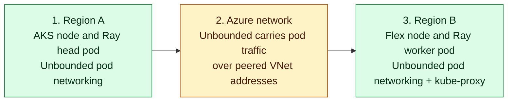

Module 2 created the Linux VM in **Region B**. In this module, you join that
host to the AKS cluster in **Region A** as an AKS Flex node. The AKS cluster uses
`networkPlugin=none`, and Unbounded owns the networking path on both the managed
AKS nodes and the Flex node.

## What You Will Do

You will verify the managed AKS network profile, inspect the provisioned Flex
VM, generate the join configuration from the current stable AKS Flex Node
release, and bootstrap the host. After that, you will schedule test pods and
confirm pod addressing, DNS, HTTPS access, and two-way traffic between AKS
and Flex before you connect Anyscale.

## How Flex networking works

AKS Flex Node prepares the external machine and joins it to AKS as a worker. It
does not provide the pod network. Unbounded manages the pod networking path for
both the managed AKS nodes and the Flex node. It allocates Flex pod addresses,
runs kube-proxy only on Flex, and links the managed AKS and Flex sites over the
peered VNets. Unbounded discovers the managed AKS node pod `/24`s and the Flex
pod range, then carries pod traffic between the nodes' private IP addresses.

<!-- Keep this diagram in sync with assets/architecture/02-flex-networking.mmd. -->

<div className="network-explainer">
<div className="network-diagram">



</div>
<aside className="translation-bubble">
  <strong>Put simply, this means:</strong>
  <p>Flex Node joins the machine to AKS. Unbounded connects its Flex pod network to the managed AKS pod network.</p>
</aside>
</div>

This pod network supports the services the workload expects:

| Workload need | What happens |
| --- | --- |
| Pod addresses | Unbounded manages pod addressing for the AKS-hosted and Flex-hosted workers, with the Flex node assigned a `/24` from `TF_VAR_unbounded_flex_pod_cidr`. |
| Kubernetes names and services | Flex pods use normal `ClusterFirst` DNS. Unbounded-managed kube-proxy handles ClusterIP traffic on Flex, while the managed AKS path uses the same Unbounded ownership model. |
| External HTTPS | Flex pods leave through the Flex host's Azure network path. The lab verifies HTTPS access to Anyscale. |

The Flex host reaches the public AKS API over HTTPS to join the cluster and
report node state. That connection is separate from the pod network. Step 5
checks pod addressing, DNS, ClusterIP routing in both directions, pod traffic
between the regions, and external HTTPS using short-lived test pods.

## Step 1: Check the AKS network profile

The AKS-managed nodes must run with `networkPlugin=none` before Unbounded adds
the separate Flex network. Read the live profile before you join the Flex host:

```bash
source .env
RESOURCE_GROUP="rg-${TF_VAR_project}-${TF_VAR_environment}-${TF_VAR_region_short}"
CLUSTER_NAME="aks-${TF_VAR_project}-${TF_VAR_environment}-${TF_VAR_region_short}"

az aks show \
  --resource-group "$RESOURCE_GROUP" \
  --name "$CLUSTER_NAME" \
  --query 'networkProfile.{plugin:networkPlugin,serviceCidr:serviceCidr,podCidr:podCidr}' \
  -o json
```

The foundation prints this profile:

```json
{
  "plugin": "none",
  "serviceCidr": "10.100.0.0/16",
  "podCidr": "<AKS control-plane value or null>"
}
```

The `plugin` value must be `none`. AKS can still report a cluster-level
`podCidr`; Unbounded assigns the active managed-node pod ranges from
`TF_VAR_cilium_pod_cidr`. `TF_VAR_unbounded_flex_pod_cidr` is the separate Flex
pod range managed by Unbounded.

## Step 2: Check the provisioned Flex host

Both the CPU and GPU paths use Ubuntu 24.04, which is the image this lab
validates. Keep that image unless you intentionally test and revalidate a
different one. Check the selected host image and the VM name created in Module 2:

```bash
grep '^TF_VAR_flex_host_source_image_reference=' .env
./scripts/anyscale-aks.sh output -raw flex_host_vm_name
```

For both paths, the image line must include `Canonical`, `ubuntu-24_04-lts`, and
`server`. For the GPU path, Terraform also installs the Azure NVIDIA driver
extension on the Flex VM. Module 5 checks the driver and installs the Kubernetes
device plugin that advertises that GPU to workloads.

The second command prints a `vm-flex-...` name. The VM does not have secondary
pod IPs. Unbounded assigns worker pod addresses from the Flex pod range after
the node joins.

## Step 3: Generate the Flex join configuration

Generate the configuration after the VM exists:

```bash
./scripts/anyscale-aks.sh flex-config
```

This command finds the current stable AKS Flex Node release, downloads the
matching configuration tool, creates a bootstrap token, and saves the join
configuration at `.cache/flex/aks-flex-node-config.json`.

Expected output includes:

```text
AKS Flex Node stable release: v<latest>
generated: <repository-path>/.cache/flex/aks-flex-node-config.json
```

If GitHub cannot answer the stable-release lookup, wait briefly and rerun this
same command. Do not replace the stable-release lookup with a version copied from
another run, because the bootstrap command checks that the configuration and
archive use the same release.

## Step 4: Bootstrap the Flex host

```bash
./scripts/anyscale-aks.sh flex-bootstrap
```

This command copies the configuration to the VM, verifies the downloaded archive,
and starts AKS Flex Node so the machine joins your cluster. It then applies the
labels this lab uses to target the node, adds a taint, and approves the node's
certificate request so the cluster trusts it.

A taint marks the node as reserved. Ordinary pods will not land on it unless they
explicitly tolerate that mark, which keeps unrelated workloads off the machine you
provisioned for this lab.

On a newly created Ubuntu VM, the command waits for cloud-init and the package
manager before it installs the Flex components. A short pause at this point is
expected. If the command reaches its timeout, rerun the same command after the
host finishes its first-start tasks.

## Step 5: Verify the Flex workload network

After the node reports `Ready`, run the networking checks:

```bash
./scripts/validate-lab.sh m3
```

Expected output includes:

```text
PASS M3-01/M3-02 Flex VM exists and is running
PASS M3-03/M3-04 Flex node joined and Ready
PASS M3-05 Flex host runs Ubuntu 24.04
PASS AKS no-CNI path is active for the Unbounded lab flow
PASS Flex node <flex-node-name> Ready in <region-b>
PASS Unbounded owns the no-CNI AKS and Flex networking path
PASS Flex ClusterFirst DNS resolves Anyscale and Kubernetes service names
PASS Flex pod HTTPS egress reaches console.azure.anyscale.com
PASS Unbounded connectivity: bilateral pod traffic and ClusterIP routing from AKS and Flex
```

If the command prints `FAIL` or `ERROR`, open the saved result for the check that
failed. Use `flex-host-runtime.json` for VM or join problems, and
`aks-network-profile.json` with the Unbounded site and node files for pod-network
problems. Use the DNS, egress, or route pod logs for a traffic problem. Correct
the problem, then rerun the same Module 3 command. Continue to Module 4 after
every required check reports `PASS`.

## Success evidence

The networking command saves its detailed results under
`.cache/lab-validation/m3-flex-network/`. Keep these files if you need to compare
pod networking or host details later:

| Result | What it shows |
| --- | --- |
| `flex-host-runtime.json` | The Flex VM runs the validated Ubuntu 24.04 host image and records its kernel version. |
| `aks-network-profile.json` | AKS runs with `networkPlugin=none`, so Unbounded provides pod networking. |
| `unbounded-sites-runtime.json`, `unbounded-sitepeering-runtime.json`, and `unbounded-nodes-runtime.json` | Unbounded assigned the configured pod ranges and connected the AKS and Flex sites. |
| `aks-active-cni-files.txt`, `flex-active-cni-files.txt`, and `aks-unbounded0-tc-filters.txt` | Unbounded is the only pod-network component configuring each node. |
| DNS, egress, and route pod logs | A Flex pod resolved Kubernetes names, reached HTTPS, and exchanged direct and ClusterIP traffic with an AKS pod in both directions. |

## Next step

Proceed to [Module 4: Connect Anyscale to AKS](./module-04-anyscale-binding).
