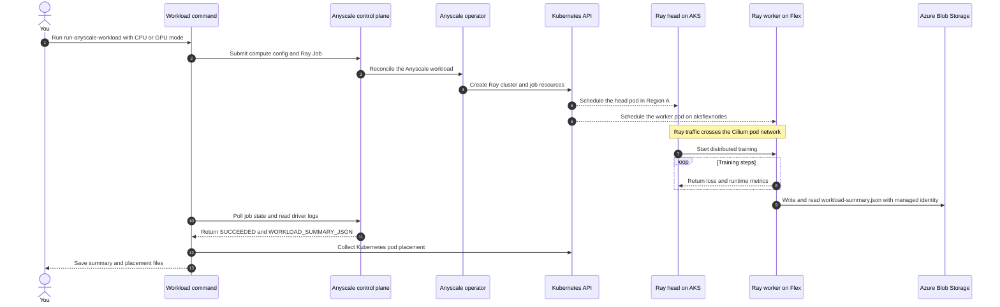

In this setup, you will run `deepspeed_finetune`, a Ray Train and DeepSpeed
distributed training workload. The Ray head runs on AKS CPU capacity in
**Region A**, while the worker runs on the Flex node in **Region B**. The workload
writes the worker hostname, region hint, and device details to
`workload-summary.json`. You will compare that summary with Kubernetes node,
node-pool, and region data to confirm exactly where the worker ran.

## What You Will Do

After the readiness checks pass, you will submit the workload through Anyscale
and watch the Ray head and worker pods land on different parts of the cluster.
You will inspect the saved summary and Kubernetes placement data instead of
relying on the Anyscale job status alone.

## How the workload runs

The submission command crosses three management boundaries before training
starts: Anyscale accepts the job, the operator creates Kubernetes resources, and
the Kubernetes scheduler places the Ray pods. The Ray head runs on the AKS CPU
pool, while the worker runs on the Flex node selected by the compute config.

<!-- Keep this diagram in sync with assets/architecture/03-workload-execution.mmd. -->



The saved summary shows what the workload reported. The Kubernetes placement
file independently shows which node ran the worker, so you compare both before
accepting the result.

## Path differences

| Step | CPU path | GPU path |
| ------ | ---------- | ------------ |
| Compute config | Created by `./scripts/run-anyscale-workload.sh --mode cpu` | Created by `./scripts/run-anyscale-workload.sh --mode gpu` |
| Workers | CPU-only Ray actors on the Flex node | GPU-accelerated Ray Train workers on the Flex node |
| Results | Placement + loss curve + workload summary | Placement + GPU utilization + loss curve |
| Duration | ~10 min | ~20-40 min (includes autoscale wait) |

## Step 1: Verify the Flex workload path

Run the workload only after the readiness checks pass. The Flex diagnostic pod
must use normal `ClusterFirst` DNS, and the Flex node must not carry the broad
`kubernetes.azure.com/cluster` label.

```bash
source .env
FLEX_NODE="vm-flex-${TF_VAR_project}-${TF_VAR_environment}-${TF_VAR_flex_region_short}"
if kubectl get node "$FLEX_NODE" -o json | \
  jq -e '.metadata.labels | has("kubernetes.azure.com/cluster")' >/dev/null; then
  echo "FAIL: broad kubernetes.azure.com/cluster label is present"
  exit 1
else
  echo "PASS: broad kubernetes.azure.com/cluster label is absent"
fi
kubectl -n kube-system rollout status ds/cilium --timeout=3m
kubectl -n kube-system rollout status ds/cilium-envoy --timeout=3m
```

Expected output:

```text
PASS: broad kubernetes.azure.com/cluster label is absent
daemon set "cilium" successfully rolled out
daemon set "cilium-envoy" successfully rolled out
```

## Step 2: Choose the run size

Set `profile` in the workload call:

Use the `smoke` profile for a quick first run. It uses 1 epoch, 4 debug steps,
and 2 workers, which usually finishes in about 10 minutes. Use `full` only when you want the longer
run: all epochs, the full dataset path, and up to 4 workers for GPU saturation.

For a first run, start with `smoke`.

## Step 3: Run the workload locally

Run the workload logic without a cluster:

```bash
./scripts/run-workload-smoke.sh
```

On the first run, the wrapper creates a temporary Python environment and installs
the local Torch, DeepSpeed, Ray, and Transformers dependencies. That install can
take 5-15 minutes, depending on your network and workstation. The wrapper prints
each phase before the workload starts, so active phase output is normal progress
rather than a stalled run.

This runs `train.py --profile smoke --cpu-only --local-smoke` locally and
produces a workload summary at
`.cache/workloads/deepspeed_finetune/smoke/workload-summary.json`. The local smoke
path uses native PyTorch for the training steps, so macOS does not try to compile
DeepSpeed's Linux OpenMP extension. The Anyscale workload still runs DeepSpeed.

Check the output:

```bash
python3 workloads/deepspeed_finetune/validate_workload_summary.py \
  .cache/workloads/deepspeed_finetune/smoke/workload-summary.json
```

Expected output:

```text
validated: .cache/workloads/deepspeed_finetune/smoke/workload-summary.json
```

The local workload summary records the run ID, experiment name, timestamp, profile,
`local_smoke=true`, placement hints, loss curve, runtime counters, and worker
snapshots. Remote Anyscale summaries set `local_smoke=false`. The `storage_result`
field records the account, container, path, and `az://` URI used by the workload,
confirming that managed identity could write and read the result.

## Step 4: Submit the CPU workload

```bash
./scripts/run-anyscale-workload.sh --mode cpu
```

Expected output:

```text
Gateway anyscale-operator/anyscale-gateway programmed address: 172.193.180.193
(anyscale +1.2s) Created compute config: 'cpu-home:6'
info: submit attempt 1/3 for flex-results-cpu-20260708-235149
(anyscale +2m26.1s) Job 'flex-results-cpu-20260708-235149' transitioned from STARTING to RUNNING
(anyscale +5m1.0s) Job 'flex-results-cpu-20260708-235149' reached target state, exiting
```

:::note Expected CPU placement
The CPU run places the Ray head on AKS CPU capacity in Region A and the Ray worker
on the Flex node in Region B. The worker uses `ClusterFirst` DNS, and Cilium
allocates both pod addresses from `TF_VAR_cilium_pod_cidr`.
:::

## GPU path: Submit through Anyscale

Run this only after the readiness checks report an allocatable GPU on the Flex
node. The GPU workload requires a GPU-ready Flex host image with NVIDIA drivers
and the NVIDIA device plugin installed on the Flex node.

```bash
./scripts/run-anyscale-workload.sh --mode gpu
```

Expected output includes GPU compute config creation and an autoscale wait if the
GPU image needs to pull on the Flex node:

```text
(anyscale +1.3s) Created compute config: 'gpu-home:1'
info: submit attempt 1/3 for flex-results-gpu-20260709-110159
(anyscale +6m44.7s) Job 'flex-results-gpu-20260709-110159' transitioned from STARTING to RUNNING
```

The first GPU run can spend much of the 15-minute worker startup allowance
pulling the CUDA Ray image. `STARTING` followed by `RUNNING` is normal progress;
use the job logs and placement checks in the next step if it does not advance.
The default GPU run starts one `GPU:1` worker. Increase
`ANYSCALE_RESULTS_GPU_WORKER_COUNT` only when the selected Flex host exposes
enough GPUs for additional workers. If the GPU worker pod stays Pending because
its `nvidia.com/gpu.product` selector does not match the Flex node, correct
`ANYSCALE_RESULTS_GPU_PRODUCT_LABEL` and rerun
`./scripts/install-nvidia-device-plugin.sh`. The script applies that product
label after confirming `nvidia.com/gpu` is allocatable.

## Step 5: Watch the job and pod placement

```bash
kubectl get pods -n anyscale-operator -o wide | grep -E 'NAME|k-'
ANYSCALE_HOST=https://console.azure.anyscale.com .venv/bin/anyscale job status --name <job-name> --json --verbose
ANYSCALE_HOST=https://console.azure.anyscale.com .venv/bin/anyscale job logs --name <job-name> --tail --max-lines 160
```

Expected output:

```text
NAME                                      READY   STATUS    NODE
k-flex-results-cpu-head-abcde              1/1     Running   aks-cpu-33840755-vmss000000
k-flex-results-cpu-worker-group-0-fghij    1/1     Running   <flex-node-name>
k-flex-results-gpu-head-abcde              1/1     Running   aks-cpu-33840755-vmss000000
k-flex-results-gpu-worker-group-0-fghij    1/1     Running   <flex-node-name>

"state": "SUCCEEDED"
"WORKLOAD_SUMMARY_JSON={...}"
```

## Step 6: Review the workload summary

For local smoke runs, the summary is written locally under `.cache/workloads/...`.
For Anyscale job runs, `./scripts/run-anyscale-workload.sh` extracts the
`WORKLOAD_SUMMARY_JSON` log record and writes it under `.cache/anyscale/results/`.
It also writes Kubernetes placement results for the job, including pod IP, node,
node region, node pool, and Ray node type.
The workload also writes and reads the same summary through the Anyscale workload
managed identity using the fsspec/adlfs `az://` protocol; no SAS token or shared
storage key is used.

:::note Storage RBAC
The Anyscale workload managed identity needs `Storage Blob Data Contributor` on the
dedicated storage account because the workload writes and reads its result. To
download that blob with `az storage ... --auth-mode login`, you also need a
data-plane role such as `Storage Blob Data Reader` or `Storage Blob Data Contributor`.
Management-plane ownership alone is not enough for blob data reads.
:::

```bash
OUT=.cache/anyscale/results/<job-name>-workload-summary.json

python3 workloads/deepspeed_finetune/validate_workload_summary.py \
  "$OUT"
```

Expected output:

```text
validated: .cache/anyscale/results/flex-results-cpu-20260708-1712-workload-summary.json
```

Expected `workload-summary.json` shape:

```json
{
  "run_id": "flex-results-cpu-20260708-192330",
  "profile": "smoke",
  "local_smoke": false,
  "placement": {
    "expected_regions": ["<region-a>", "<region-b>"],
    "observed_region_hint": "<region-b>",
    "observed_node_hint": "k-be9e65e2681b30000",
    "observed_world_size": 1
  },
  "runtime_versions": {
    "python": "3.11.11",
    "ray": "2.54.1",
    "cloudpickle": "2.2.0",
    "adlfs": "2023.8.0",
    "fsspec": "2023.12.1",
    "deepspeed": "0.19.3",
    "torch": "2.13.0",
    "transformers": "5.14.1"
  },
  "storage_result": {
    "account_name": "stflexanydev<region-a-short><hash>",
    "container_name": "flexany-dev-blob",
    "client_id_present": true,
    "path": "flexany-dev-blob/anyscale/results/<job-name>/workload-summary.json",
    "uri": "az://flexany-dev-blob/anyscale/results/<job-name>/workload-summary.json"
  }
}
```

## Step 7: Confirm the worker ran on the Flex node

Open `workload-summary.json` and check the `placement` and `storage_result` sections:

```bash
jq '{placement, storage_result}' .cache/anyscale/results/<job-name>-workload-summary.json
jq '.pods[] | {name, pod_ip, node_name, node_region, node_agentpool, ray_node_type}' \
  .cache/anyscale/results/<job-name>-kubernetes-placement.json
```

Expected output:

```json
{
  "placement": {
    "expected_regions": ["<region-a>", "<region-b>"],
    "observed_world_size": 1
  },
  "storage_result": {
    "client_id_present": true,
    "uri": "az://..."
  }
}
{
  "name": "k-flex-results-cpu-worker-group-0-fghij",
  "pod_ip": "10.83.0.36",
  "node_name": "<flex-node-name>",
  "node_region": "<region-b>",
  "node_agentpool": "aksflexnodes",
  "ray_node_type": "worker"
}
```

Derive the expected region values from `.env` before judging pass/fail:

```bash
source .env
echo "home=${TF_VAR_azure_location} flex=${TF_VAR_flex_region}"
```

Pass means the Ray head ran on Region A AKS capacity, the Ray worker ran on
`agentpool=aksflexnodes` in Region B, and the collected placement JSON records
that worker after Kubernetes removes completed pods. Use that JSON as the
authoritative placement evidence after cleanup.

Verify the worker ran on Flex by checking worker log lines for the Ray worker IP,
then confirm Kubernetes placed that worker pod on the Flex node. The
worker pod IP comes from the Cilium cluster pool (for example `10.83.0.0/16`), and
Cilium carries the traffic through its VXLAN tunnel between the AKS and Flex nodes.

```bash
source .env
export ANYSCALE_HOST="https://console.azure.anyscale.com"
.venv/bin/anyscale job logs --name <job-name> |
  grep -m1 -oE '\(RayTrainWorker pid=[^)]*\)'

kubectl get pods -n anyscale-operator \
  -l "app.kubernetes.io/name=<job-name>" \
  -o wide --show-labels
```

Expected output:

```text
RayTrainWorker pid=336, ip=10.83.0.36
k-be9e65e2681b30000   5/5   Running   10.83.0.36   <flex-node-name>   ... ray-node-type=worker
```

Anyscale may remove the worker pod after the job completes. If the live pod list
contains only the completed head pod, use the worker entry in the collected
`<job-name>-kubernetes-placement.json` file above as the placement proof.

The summary check confirms that the remote CPU worker reports the Flex
region and that Kubernetes placed a worker pod on `agentpool=aksflexnodes`. The
GPU path also requires `nvidia.com/gpu` allocation. A home-region value by itself
is not enough to confirm placement.

## Troubleshooting

### Worker health-check or cloudpickle failure

If Anyscale reports `A worker health check failed` from
`RayTrainWorker.poll_status()` and the traceback ends in `ray.cloudpickle`, keep
the failed job instead of immediately submitting another one. Collect the job
status and logs first:

```bash
source .env
export ANYSCALE_HOST="https://console.azure.anyscale.com"
JOB=<failed-job-name>

.venv/bin/anyscale job status --name "$JOB" --json --verbose \
  > ".cache/anyscale/${JOB}-failed-status.json"

.venv/bin/anyscale job logs --name "$JOB" --tail --max-lines 1000 \
  > ".cache/anyscale/${JOB}-failed.log"

kubectl -n anyscale-operator get pods \
  -l "app.kubernetes.io/name=$JOB" -o wide --show-labels
```

Compare the failed run with the `runtime_versions` object from a successful run.
Package versions matter here because the traceback occurs while Ray serializes a
worker status result. Also record the Ray worker pod IP, node, restart count, and
termination reason. A pod restart, eviction, or node loss points to worker health;
a stable pod with a repeatable serialization traceback points to the Ray runtime
or an object returned through the training status path.

## Step 8: Inspect the workload in the Anyscale console

The command-line summary and placement JSON are the authoritative placement
evidence. The Anyscale Console supplements them with the control-plane view of
the same run: job state, cluster shape, application logs, and live metrics.
Capture these screens while the job is still `Running` when you can, especially
for the GPU path where the metrics panels show GPU use.

1. Open `https://console.azure.anyscale.com`.
2. Select the cloud you created. Its name matches the Anyscale Platform cloud in
  Terraform, for example `/subscriptions/.../resourcegroups/<resource-group>/providers/anyscale.platform/clouds/<cloud-name>`.
3. Select the `default` project.
4. Open **Jobs** from the left navigation.
5. Select your workload job. The job name starts with `flex-results-cpu-` or
  `flex-results-gpu-`.

Use the Jobs list first. It should show the completed CPU and GPU jobs, or
the active GPU job if you capture results during a longer run. This screen shows
that Anyscale accepted and tracked the job alongside the Kubernetes placement
data.


On the **Overview** tab, check the status and the cluster summary. For the GPU
path, the header should show two nodes and one GPU while the run is active. The
job details should show the run name, `anyscale/ray:2.54.1-py311-cu121`,
the `gpu-home` compute config, and the full `python train.py ...` entrypoint.
This screen connects the Anyscale Job to the compute config and container image
used for the run.


Open **Logs**, keep **Application logs** selected, choose the current job attempt,
and set **Component** to `Driver`. Look for `WORKLOAD_SUMMARY_JSON=`. That line is
the console-side copy of the summary written under
`.cache/anyscale/results/`. In the GPU path, the same line should include the Flex
placement hints, the expected home and Flex regions, `cuda_available=true`, and
the storage result URI.


Open **Metrics**. Use the **Core**, **Data**, and **Train** tabs to inspect the
dashboard categories. If the embedded panel area is blank, select **View tab in
Grafana** from the Metrics page. The direct Grafana page should keep the same
`ClusterId` as the Anyscale Job session.

On the Grafana overview, check **Node Count** and **Workload Instances**. The GPU
run should show one head node and one `gpu-worker`. The workload instance IPs
should match the placement results: both are allocated from the Cilium pod CIDR.


On the same Grafana dashboard, check **Cluster Utilization**. For the GPU path,
`GPU (physical)` should rise above idle while the Ray Train worker is running.
This graph shows that the Flex GPU was used during the workload,
while the placement JSON shows which node hosted that worker.


You can also keep a wider Grafana dashboard capture with node count, workload
instances, and utilization in one frame. Use it when you need one screenshot that
summarizes the run for a review or report.


Record these Console checks with the workload results:

| Screen | What to capture | What it shows |
| ------ | --------------- | -------------- |
| Jobs list | `flex-results-cpu-*` and `flex-results-gpu-*` rows | The jobs ran through the Anyscale control plane |
| Overview | Job status, node/GPU summary, image, compute config, entrypoint | The job used the expected Ray image and compute config |
| Logs | `WORKLOAD_SUMMARY_JSON=` in Driver logs | The Console contains the same workload summary as the local file |
| Metrics / Grafana | Node count, workload instances, GPU utilization | The active cluster had a head node, a GPU worker, and non-idle GPU use |

If the Metrics page shows `This job is active, but your browser is unable to
communicate with it`, run the diagnostic command printed in the warning before
submitting another workload:

```bash
source .env
export ANYSCALE_HOST="https://console.azure.anyscale.com"
.venv/bin/anyscale cluster network_debug <session-id>
```

A healthy path reports successful DNS lookup, TCP connect, TLS connect, and HTTPS
GET for the `session-*.i.azure.anyscaleuserdata.com` hostname. The session hostname
must resolve to the same public IP as the Anyscale Gateway in Kubernetes:

```bash
dig +short session-<session-id-without-ses-prefix>.i.azure.anyscaleuserdata.com
kubectl get gateway anyscale-gateway -n anyscale-operator \
  -o jsonpath='{.status.addresses[0].value}{"\n"}'
```

## Confirm Flex GPU placement

After a GPU run, use the placement file to confirm that the Ray GPU worker landed
on the Flex node:

```bash
source .env
FLEX_NODE="vm-flex-${TF_VAR_project}-${TF_VAR_environment}-${TF_VAR_flex_region_short}"
jq -e --arg node "$FLEX_NODE" --arg region "$TF_VAR_flex_region" '
  .pods[]
  | select(.ray_node_type == "worker")
  | {name,node_name,node_region,node_agentpool}
  | select(.node_name == $node and .node_region == $region and .node_agentpool == "aksflexnodes")
' \
  .cache/anyscale/results/<job-name>-kubernetes-placement.json
```

Expected output:

```json
{
  "name": "k-flex-results-gpu-worker-group-0-fghij",
  "node_name": "<flex-node-name>",
  "node_region": "<region-b>",
  "node_agentpool": "aksflexnodes"
}
```

This example uses the GPU profile selected during environment setup. The command
derives the expected node and region from your `.env`, so each supported Flex
profile produces results for its configured environment.

## Results to keep

A successful result includes all three signals: `state=SUCCEEDED`, a valid
`workload-summary.json`, and Kubernetes placement data showing the worker pod on
`agentpool=aksflexnodes` in the Flex region.

## Next step

Proceed to **[Module 7: Teardown and Replay](/docs/ai-workloads-on-aks/module-07-teardown)**.
