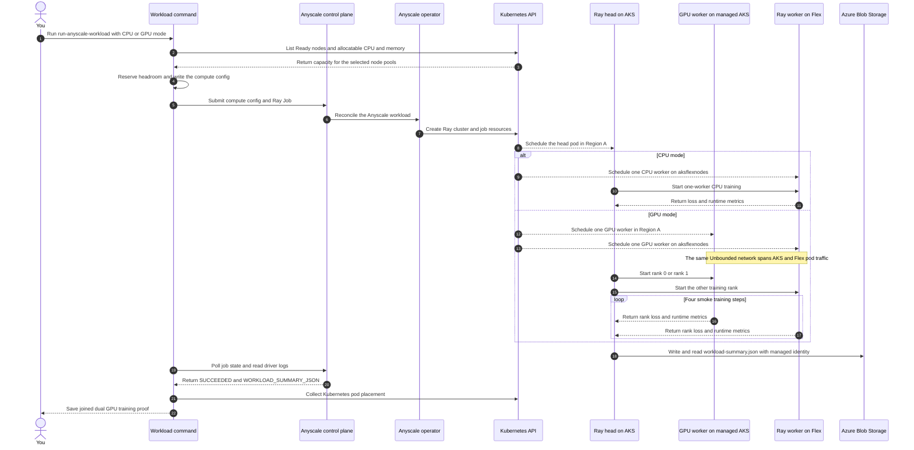
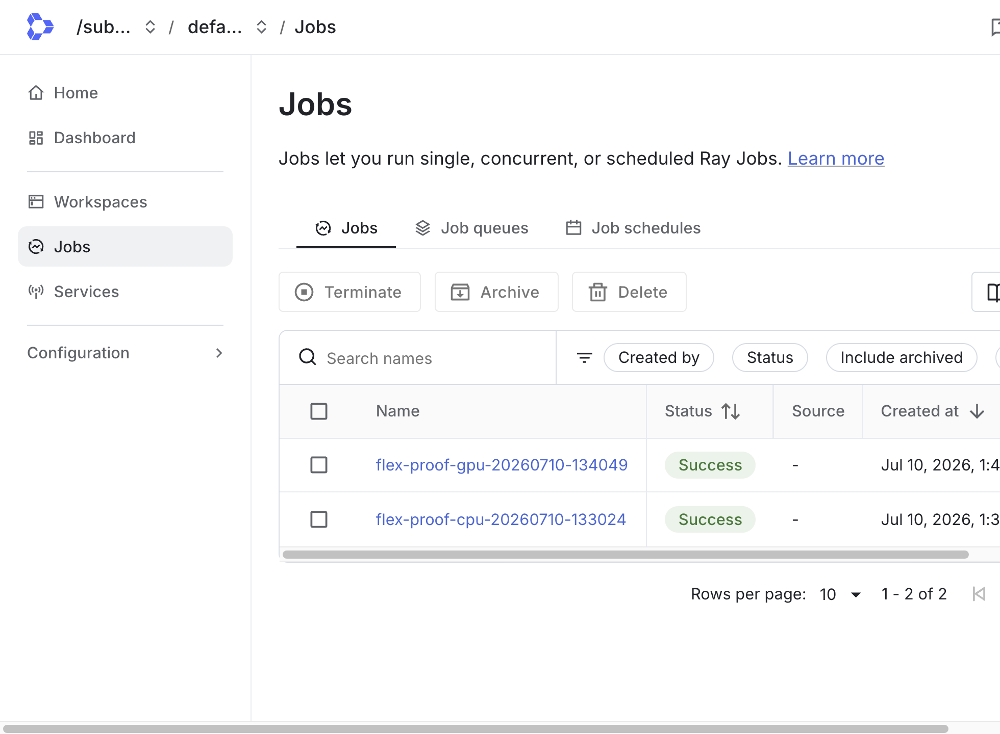
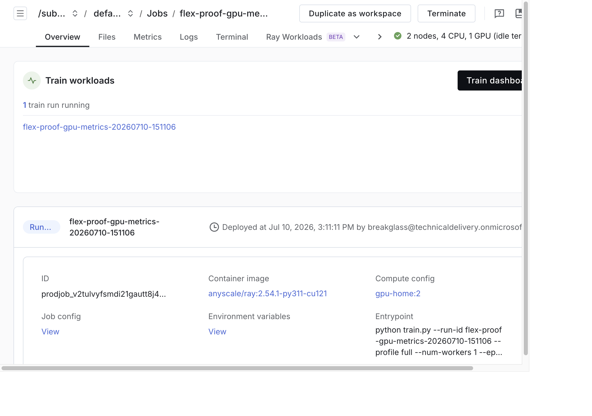
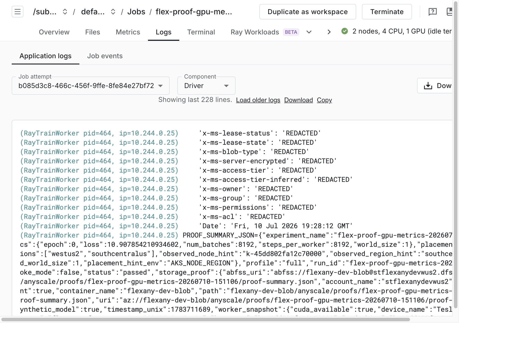
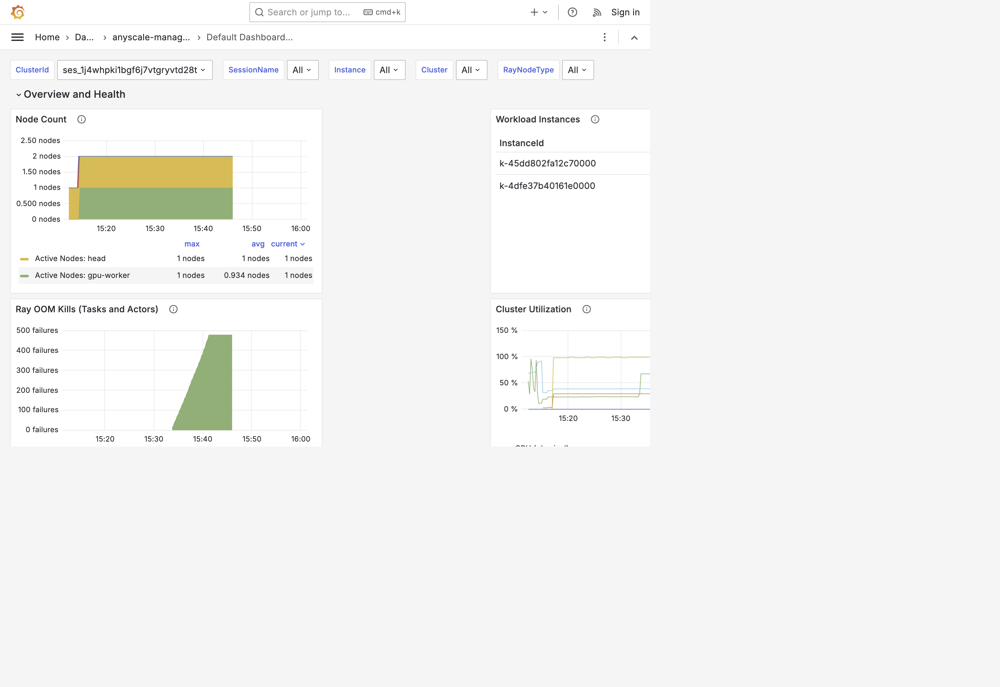
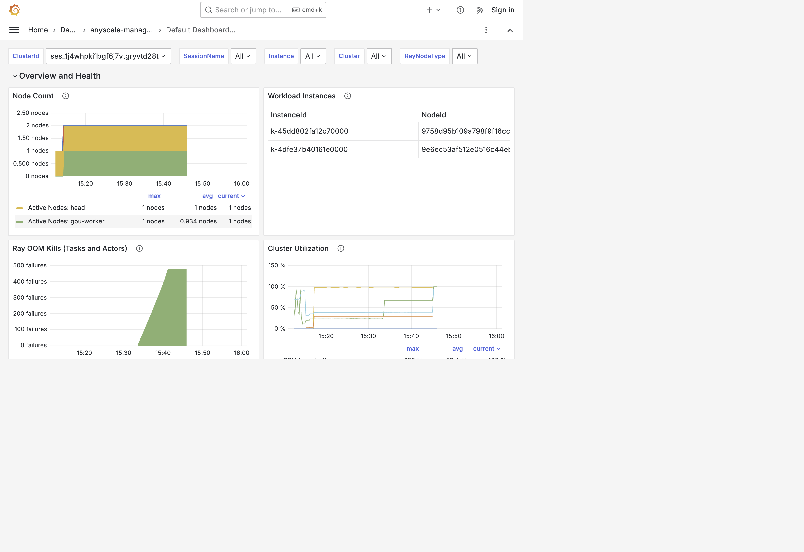
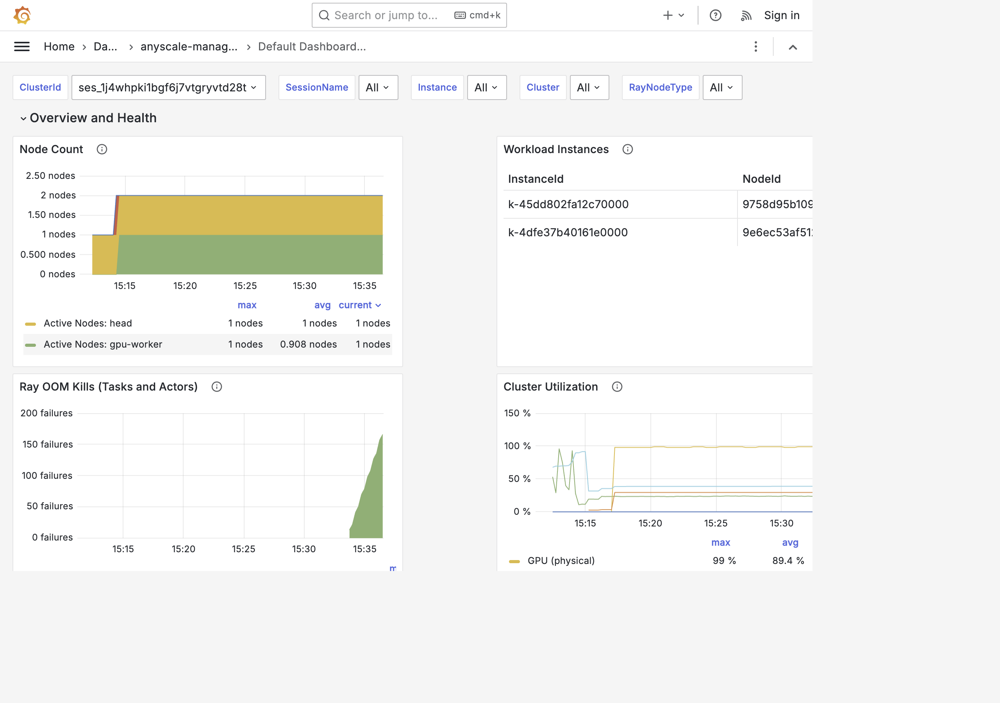

In this module, you run `deepspeed_finetune`, a Ray Train and DeepSpeed
distributed training workload. The Ray head runs on AKS CPU capacity in
**Region A**. CPU mode runs one worker on the Flex node in **Region B**. GPU mode
runs one worker on the managed AKS GPU pool and one on the Flex node. The command
joins per-rank loss and CUDA records with Kubernetes placement data so you can
prove that both GPU nodes trained in the same two-rank world.

Each worker has a rank, which is its index in the training group, as described in
[Key Concepts](./key-concepts). A two-worker run produces rank 0 and rank 1.

## What You Will Do

After the readiness checks pass, you will submit the workload through Anyscale
and watch the Ray head and two GPU worker pods land on different parts of the
cluster. You will inspect the saved dual-GPU proof instead of relying only on the
Anyscale job status or a utilization chart.

## How the workload runs

Before Anyscale accepts the job, the command reads allocatable CPU and memory
from the Ready nodes selected for each role. It reserves the headroom described
in Module 5, caps the request at the smoke workload target, and writes the
resulting compute config under `.cache/anyscale/compute-configs/`. Anyscale then
accepts the job, the operator creates Kubernetes resources, and the Kubernetes
scheduler places the Ray pods. CPU mode creates one Flex worker. GPU mode creates
one fixed worker group for the managed AKS GPU and one for the Flex GPU. Both
modes use the same sizing code and Unbounded network path.

<!-- Keep this diagram in sync with assets/architecture/03-workload-execution.mmd. -->



The saved summary shows what the workload reported. The Kubernetes placement
file independently shows where each rank ran. GPU mode accepts the result only
when the command captures both ready GPU pods running concurrently and joins both
rank hostnames to those pods.

## Path differences

| Step | CPU path | GPU path |
| ------ | ---------- | ------------ |
| Compute config | Created by `./scripts/run-anyscale-workload.sh --mode cpu` | Created by `./scripts/run-anyscale-workload.sh --mode gpu` |
| Workers | One CPU-only Ray worker on Flex | One managed AKS GPU worker and one Flex GPU worker |
| Results | Placement + loss + workload summary | Per-rank loss and CUDA data + concurrent placement proof |
| Duration | ~10 min | ~15-40 min (includes Anyscale cluster startup and CUDA image pull) |

## Step 1: Verify the Flex workload path

Run the workload only after the readiness checks pass. The Flex diagnostic pod
must use normal `ClusterFirst` DNS, and the Flex node must not carry the broad
`kubernetes.azure.com/cluster` label.

```bash
source .env
FLEX_NODE="vm-flex-${TF_VAR_project}-${TF_VAR_environment}-${TF_VAR_flex_region_short}"
if kubectl get node "$FLEX_NODE" -o json | \
  jq -e '.metadata.labels | has("kubernetes.azure.com/cluster")' >/dev/null; then
  echo "FAIL: broad kubernetes.azure.com/cluster label is present"
  exit 1
else
  echo "PASS: broad kubernetes.azure.com/cluster label is absent"
fi
kubectl -n unbounded-system rollout status daemonset/unbounded-net-node --timeout=3m
kubectl -n unbounded-system rollout status daemonset/unbounded-net-kube-proxy-flex --timeout=3m
```

Expected output:

```text
PASS: broad kubernetes.azure.com/cluster label is absent
daemon set "unbounded-net-node" successfully rolled out
daemon set "unbounded-net-kube-proxy-flex" successfully rolled out
```

## Step 2: Review the run size

The workload command submits the `smoke` profile for both CPU and GPU modes,
which runs 1 epoch and 4 training steps. CPU mode starts one worker. GPU mode
always starts two workers so each one uses one of the two available GPUs.
The training program also supports a longer `full` profile, but this lab does not
expose it. Run the `--mode cpu` or `--mode gpu` commands below without adding a
profile argument.

## Step 3: Run the workload locally

Run the workload logic without a cluster:

```bash
./scripts/run-workload-smoke.sh
```

On the first run, the command creates a temporary Python environment and installs
the local Torch, DeepSpeed, Ray, and Transformers dependencies. That install can
take 5-15 minutes, depending on your network and workstation. The command prints
each phase before the workload starts, so active phase output is normal progress
rather than a stalled run.

This runs `train.py --profile smoke --cpu-only --local-smoke` locally and
produces a workload summary at
`.cache/workloads/deepspeed_finetune/smoke/workload-summary.json`. The local smoke
path uses native PyTorch for the training steps, so macOS does not try to compile
DeepSpeed's Linux OpenMP extension. The Anyscale workload still runs DeepSpeed.

Check the output:

```bash
python3 workloads/deepspeed_finetune/validate_workload_summary.py \
  .cache/workloads/deepspeed_finetune/smoke/workload-summary.json
```

Example output:

```text
validated: .cache/workloads/deepspeed_finetune/smoke/workload-summary.json
```

The local workload summary records the run ID, experiment name, timestamp, profile,
`local_smoke=true`, placement hints, loss curve, runtime counters, and worker
snapshots. Remote Anyscale summaries set `local_smoke=false`. The `storage_result`
field records the account, container, path, and `az://` URI used by the workload,
confirming that managed identity could write and read the result.

## Step 4 (CPU path): Submit the CPU workload

```bash
./scripts/run-anyscale-workload.sh --mode cpu
```

Expected output:

```text
Gateway anyscale-operator/anyscale-gateway programmed address: <gateway-address>
(anyscale +<elapsed>) Created compute config: 'cpu-home:<version>'
info: submit attempt 1/3 for <cpu-job-name>
(anyscale +<elapsed>) Job '<cpu-job-name>' transitioned from STARTING to RUNNING
(anyscale +<elapsed>) Job '<cpu-job-name>' reached target state, exiting
```

**Expected CPU placement:** The CPU run places the Ray head on AKS CPU capacity
in Region A and the Ray worker on the Flex node in Region B. The worker uses
`ClusterFirst` DNS. Unbounded manages the pod networking path across both
managed AKS and Flex nodes, with the Flex worker address allocated from
`TF_VAR_unbounded_flex_pod_cidr`.

## Step 4 (GPU path): Submit the GPU workload

Skip this section if you are running the CPU path. Run this only after the
readiness checks report one allocatable GPU on the managed AKS pool and one on
Flex. The two worker groups use `min_nodes=1` and `max_nodes=1`, so both GPUs are
claimed before Ray Train starts.

```bash
./scripts/run-anyscale-workload.sh --mode gpu
```

Example output includes GPU compute config creation and a worker-startup wait if
the CUDA image needs to pull on the already provisioned Flex node:

```text
(anyscale +<elapsed>) Created compute config: 'gpu-dual-home:<version>'
info: submit attempt 1/3 for <gpu-job-name>
(anyscale +<elapsed>) Job '<gpu-job-name>' transitioned from STARTING to RUNNING
```

The first GPU run can spend much of the 15-minute worker startup allowance
pulling the CUDA Ray image on both nodes. `STARTING` followed by `RUNNING` is
normal progress. Do not change the two-worker count. If a GPU worker pod stays
Pending, compare its node selector with the managed product label in
`TF_VAR_gpu_pool_configs` or the Flex label in
`ANYSCALE_RESULTS_GPU_PRODUCT_LABEL`, rerun
`./scripts/install-nvidia-device-plugin.sh`, and then rerun
`./scripts/run-anyscale-workload.sh --mode gpu` so the new compute config version
uses the corrected labels.

## Step 5: Watch the job and pod placement

Copy the generated job name from the submission output into `JOB_NAME`. Then
inspect Kubernetes placement, Anyscale state, and driver logs in that order:

First compare the live allocatable values with the generated compute config.
Set `CONFIG_NAME` to the mode you submitted. The YAML should use CPU and memory
values no larger than the selected nodes can fit after headroom. A larger SKU
can keep the workload target, while a smaller SKU produces a lower request.

```bash
# Run the assignment that matches the workload you submitted.
# CPU mode: CONFIG_NAME="cpu-home"
# GPU mode: CONFIG_NAME="gpu-dual-home"
CONFIG_NAME="gpu-dual-home"

kubectl get nodes \
  -o custom-columns='NODE:.metadata.name,POOL:.metadata.labels.agentpool,CPU:.status.allocatable.cpu,MEMORY:.status.allocatable.memory,GPU:.status.allocatable.nvidia\.com/gpu'
cat ".cache/anyscale/compute-configs/${CONFIG_NAME}.yaml"
```

The submission output also records each decision:

```text
info: Ray head uses CPU=<derived-cpu> memory=<derived-memory>Gi from live capacity on agentpool=cpu
info: Flex CPU worker uses CPU=<derived-cpu> memory=<derived-memory>Gi from live capacity on agentpool=aksflexnodes
```

GPU mode prints the Ray head plus separate managed and Flex GPU worker lines.
If no Ready node can meet a role's minimum after headroom, the command stops
before creating the Anyscale Job and names the undersized role and selector.

```bash
source .env
JOB_NAME="<job-name>"
RG="rg-${TF_VAR_project}-${TF_VAR_environment}-${TF_VAR_region_short}"
CLOUD="/subscriptions/${TF_VAR_azure_subscription_id}/resourcegroups/${RG}/providers/anyscale.platform/clouds/${TF_VAR_project}-${TF_VAR_environment}-${TF_VAR_region_short}"

kubectl get pods -n anyscale-operator -o wide | grep -E 'NAME|k-'
ANYSCALE_HOST=https://console.azure.anyscale.com \
  .venv/bin/anyscale job status --name "$JOB_NAME" --cloud "$CLOUD" --json --verbose
ANYSCALE_HOST=https://console.azure.anyscale.com \
  .venv/bin/anyscale job logs --name "$JOB_NAME" --cloud "$CLOUD" --tail --max-lines 160
```

For GPU mode, run this table while the job is `STARTING` or `RUNNING`. Rerun it
until both named worker groups show `Running`. The compute config requires one
worker from each group, so a missing row means the two-worker training run is not
ready yet:

```bash
kubectl get pods -n anyscale-operator \
  -l "app.kubernetes.io/name=${JOB_NAME},ray-node-type=worker" \
  -o custom-columns='WORKER:.metadata.labels.anyscale-node-group-id,STATUS:.status.phase,NODE:.spec.nodeName,GPU:.metadata.labels.anyscale-instance-gpu-count'
```

Expected GPU placement table:

```text
WORKER               STATUS    NODE                                  GPU
managed-gpu-worker   Running   <aks-managed-gpu-node>                1
flex-gpu-worker      Running   <flex-node>                           1
```

Expected GPU pod placement:

```text
NAME                                      READY   STATUS    NODE
k-<job-name>-head-abcde                    1/1     Running   <aks-cpu-node-name>
k-<job-name>-managed-gpu-worker-fghij      1/1     Running   <aks-gpu-node-name>
k-<job-name>-flex-gpu-worker-klmno         1/1     Running   <flex-node-name>

"state": "SUCCEEDED"
"WORKLOAD_SUMMARY_JSON={...}"
```

## Step 6: Review the workload summary

For local smoke runs, the summary is written locally under `.cache/workloads/...`.
For Anyscale job runs, `./scripts/run-anyscale-workload.sh` extracts the
`WORKLOAD_SUMMARY_JSON` log record and writes it under `.cache/anyscale/results/`.
It also writes Kubernetes placement results for the job, including pod IP, node,
node region, node pool, and Ray node type.
The workload also writes and reads the same summary through the Anyscale workload
managed identity using the fsspec/adlfs `az://` protocol; no SAS token or shared
storage key is used.

:::caution Storage access is required
The Anyscale workload managed identity needs `Storage Blob Data Contributor` on the
dedicated storage account because the workload writes and reads its result. To
download that blob with `az storage ... --auth-mode login`, you also need a
role that grants blob access, such as `Storage Blob Data Reader` or
`Storage Blob Data Contributor`. Azure resource ownership alone is not enough to
read blob contents.
:::

```bash
OUT=".cache/anyscale/results/${JOB_NAME}-workload-summary.json"

python3 workloads/deepspeed_finetune/validate_workload_summary.py \
  "$OUT"
```

Example output:

```text
validated: .cache/anyscale/results/<job-name>-workload-summary.json
```

Expected `workload-summary.json` shape:

```json
{
  "run_id": "<job-name>",
  "profile": "smoke",
  "local_smoke": false,
  "placement": {
    "expected_regions": ["<region-a>", "<region-b>"],
    "observed_world_size": 2
  },
  "worker_training_records": [
    {"rank": 0, "cuda_available": true, "steps_per_worker": 4, "loss": 10.8},
    {"rank": 1, "cuda_available": true, "steps_per_worker": 4, "loss": 10.8}
  ],
  "runtime_versions": {
    "python": "<runtime-version>",
    "ray": "<runtime-version>",
    "cloudpickle": "<runtime-version>",
    "adlfs": "<runtime-version>",
    "fsspec": "<runtime-version>",
    "deepspeed": "<runtime-version>",
    "torch": "<runtime-version>",
    "transformers": "<runtime-version>"
  },
  "storage_result": {
    "account_name": "<storage-account-name>",
    "container_name": "flexany-dev-blob",
    "client_id_present": true,
    "path": "flexany-dev-blob/anyscale/results/<job-name>/workload-summary.json",
    "uri": "az://flexany-dev-blob/anyscale/results/<job-name>/workload-summary.json"
  }
}
```

## Step 7: Prove both GPU nodes trained

For CPU mode, inspect the workload summary and placement file as before:

```bash
jq '{placement, storage_result}' "$OUT"
```

For GPU mode, validate the dual-GPU proof for the end-to-end training run. This
is where you confirm that the same job spanned the managed AKS node and the Flex
node during training instead of just scheduling the pods sequentially:

```bash
source .env
PROOF=".cache/anyscale/results/${JOB_NAME}-dual-gpu-training-proof.json"

kubectl -n anyscale-operator get pods -l "app.kubernetes.io/name=${JOB_NAME}" -o wide
jq '{status, job_name, world_size, concurrent_observed_at, workers}' "$PROOF"
```

Render the saved proof as a table after the job succeeds. This output is the
screen you can capture for your lab record:

```bash
jq -r '
  ["Rank","Node","Region","Pool","GPU","CUDA","Steps","Loss"],
  (.workers[] | [
    .rank,
    .node_name,
    .node_region,
    .node_agentpool,
    .device_name,
    .cuda_available,
    .steps_per_worker,
    .loss
  ]) | @tsv
' "$PROOF" | column -t -s $'\t'
```

The table must contain two ranks. One row must name the managed GPU pool and
Region A, and the other must name `aksflexnodes` and Region B. Both rows must
show `true` under `CUDA` and a positive value under `Steps`.

Expected fields:

```json
{"status":"passed","job_name":"<gpu-job-name>","world_size":2,"concurrent_observed_at":"<utc-time>","workers":[
  {"rank":<rank-on-managed-node>,"cuda_available":true,"device_name":"<gpu>","steps_per_worker":4,"loss":<loss>,"node_name":"<managed-node>","node_region":"<region-a>","node_agentpool":"<managed-gpu-pool>","gpu_requested":1},
  {"rank":<rank-on-flex-node>,"cuda_available":true,"device_name":"<gpu>","steps_per_worker":4,"loss":<loss>,"node_name":"<flex-node>","node_region":"<region-b>","node_agentpool":"aksflexnodes","gpu_requested":1}
]}
```

Derive the expected region values from `.env` before judging pass/fail:

```bash
source .env
echo "home=${TF_VAR_azure_location} flex=${TF_VAR_flex_region}"
```

Pass means `world_size` is `2`, both ranks report CUDA and completed steps, one
rank joins to the managed GPU pool in Region A, the other joins to
`agentpool=aksflexnodes` in Region B, and `concurrent_observed_at` records when
both ready GPU pods were Running. Ray assigns ranks while the workers start, so
either rank can run on either GPU node. Keep this proof file after cleanup.

You can also watch each rank emit its training record while the job runs:

```bash
source .env
export ANYSCALE_HOST="https://console.azure.anyscale.com"
RG="rg-${TF_VAR_project}-${TF_VAR_environment}-${TF_VAR_region_short}"
CLOUD="/subscriptions/${TF_VAR_azure_subscription_id}/resourcegroups/${RG}/providers/anyscale.platform/clouds/${TF_VAR_project}-${TF_VAR_environment}-${TF_VAR_region_short}"
.venv/bin/anyscale job logs --name "$JOB_NAME" --cloud "$CLOUD" --tail --max-lines 400 |
  grep 'WORKER_TRAINING_JSON='
```

Example output:

```text
WORKER_TRAINING_JSON={"rank":0,"world_size":2,"cuda_available":true,"steps_per_worker":4,"loss":<loss>,...}
WORKER_TRAINING_JSON={"rank":1,"world_size":2,"cuda_available":true,"steps_per_worker":4,"loss":<loss>,...}
```

Anyscale may remove worker pods after completion. The command samples placement
every five seconds and retains the concurrent record, so the proof does not
depend on completed pods remaining in Kubernetes.

## Troubleshooting

### Worker health-check or cloudpickle failure

If Anyscale reports `A worker health check failed` from
`RayTrainWorker.poll_status()` and the traceback ends in `ray.cloudpickle`, keep
the failed job instead of immediately submitting another one. Collect the job
status and logs first:

```bash
source .env
export ANYSCALE_HOST="https://console.azure.anyscale.com"
FAILED_JOB="<failed-job-name>"
RG="rg-${TF_VAR_project}-${TF_VAR_environment}-${TF_VAR_region_short}"
CLOUD="/subscriptions/${TF_VAR_azure_subscription_id}/resourcegroups/${RG}/providers/anyscale.platform/clouds/${TF_VAR_project}-${TF_VAR_environment}-${TF_VAR_region_short}"

.venv/bin/anyscale job status --name "$FAILED_JOB" --cloud "$CLOUD" --json --verbose \
  > ".cache/anyscale/${FAILED_JOB}-failed-status.json"

.venv/bin/anyscale job logs --name "$FAILED_JOB" --cloud "$CLOUD" --tail --max-lines 1000 \
  > ".cache/anyscale/${FAILED_JOB}-failed.log"

kubectl -n anyscale-operator get pods \
  -l "app.kubernetes.io/name=$FAILED_JOB" -o wide --show-labels
```

Compare the failed run with the `runtime_versions` object from a successful run.
Package versions matter here because the traceback occurs while Ray serializes a
worker status result. Also record the Ray worker pod IP, node, restart count, and
termination reason. A pod restart, eviction, or node loss points to worker health;
a stable pod with a repeatable serialization traceback points to the Ray runtime
or an object returned through the training status path.

## Step 8: Optionally inspect the workload in the Anyscale console

The required Module 6 proof is complete after Step 7 shows both CUDA ranks,
completed training steps, and concurrent managed/Flex placement. You can finish
the module without screenshots. The optional Anyscale Console tour supplements
that file with job state, cluster shape, application logs, and live metrics.

1. Open `https://console.azure.anyscale.com`.
2. Select the cloud you created. Its name matches the Anyscale Platform cloud in
  Terraform, for example `/subscriptions/.../resourcegroups/<resource-group>/providers/anyscale.platform/clouds/<cloud-name>`.
3. Select the `default` project.
4. Open **Jobs** from the left navigation.
5. Select your workload job. The job name starts with `flex-results-cpu-` or
  `flex-results-gpu-`.

Use the Jobs list first. It should show the completed CPU and GPU jobs, or
the active GPU job if you capture results during a longer run. This screen shows
that Anyscale accepted and tracked the job alongside the Kubernetes placement
data.



On the **Overview** tab, check the status and the cluster summary. For the GPU
path, the header should show three nodes and two GPUs while the run is active.
The job details should show the run name, the submitted Ray image, the `gpu-dual-home`
compute config, and the full `python train.py ...` entrypoint.
This screen connects the Anyscale Job to the compute config and container image
used for the run.



Open **Logs**, keep **Application logs** selected, choose the current job attempt,
and set **Component** to `Driver`. Look for `WORKLOAD_SUMMARY_JSON=`. That line is
the console-side copy of the summary written under
`.cache/anyscale/results/`. In the GPU path, the same log stream should include
two `WORKER_TRAINING_JSON=` records with ranks `0` and `1`, CUDA enabled, and
completed step counts.



Open **Metrics**. Use the **Core**, **Data**, and **Train** tabs to inspect the
dashboard categories. If the embedded panel area is blank, select **View tab in
Grafana** from the Metrics page. The direct Grafana page should keep the same
`ClusterId` as the Anyscale Job session.

On the Grafana overview, check **Node Count** and **Workload Instances**. The GPU
run should show one head node, one `managed-gpu-worker`, and one
`flex-gpu-worker`. The workload instance IPs should match the proof: the managed
pods and Flex worker use the same Unbounded-backed pod path across both node
domains.



On the same Grafana dashboard, check **Cluster Utilization**. For the GPU path,
`GPU (physical)` should rise above idle while the Ray Train worker is running.
This aggregate graph shows GPU use during the workload. The dual-GPU proof file,
not the aggregate graph, shows that both node domains trained across the single
Unbounded network path.



You can also keep a wider Grafana dashboard capture with node count, workload
instances, and utilization in one frame. Use it when you need one screenshot that
summarizes the run for a review or report.



Record these Console checks with the workload results:

| Screen | What to capture | What it shows |
| ------ | --------------- | -------------- |
| Jobs list | `flex-results-cpu-*` and `flex-results-gpu-*` rows | The jobs ran through the Anyscale control plane |
| Overview | Job status, node/GPU summary, image, compute config, entrypoint | The job used the expected Ray image and compute config |
| Logs | `WORKLOAD_SUMMARY_JSON=` in Driver logs | The Console contains the same workload summary as the local file |
| Metrics / Grafana | Three nodes, two GPU worker groups, GPU utilization | The active cluster had both GPU capacities while the proof records each rank |

If the Metrics page shows `This job is active, but your browser is unable to
communicate with it`, run the diagnostic command printed in the warning before
submitting another workload:

```bash
source .env
export ANYSCALE_HOST="https://console.azure.anyscale.com"
SESSION_ID="<session-id>"

.venv/bin/anyscale cluster network_debug "$SESSION_ID"
```

A healthy path reports successful DNS lookup, TCP connect, TLS connect, and HTTPS
GET for the `session-*.i.azure.anyscaleuserdata.com` hostname. The session hostname
must resolve to the same public IP as the Anyscale Gateway in Kubernetes:

```bash
SESSION_HOST_ID="${SESSION_ID#ses_}"
dig +short "session-${SESSION_HOST_ID}.i.azure.anyscaleuserdata.com"
kubectl get gateway anyscale-gateway -n anyscale-operator \
  -o jsonpath='{.status.addresses[0].value}{"\n"}'
```

## Recheck dual GPU placement

After a GPU run, confirm that the saved proof contains exactly the managed GPU
pool and Flex pool:

```bash
source .env
JOB_NAME="<job-name>"
PROOF=".cache/anyscale/results/${JOB_NAME}-dual-gpu-training-proof.json"
MANAGED_GPU_POOL="$(jq -r 'to_entries[0].value.name' <<<"$TF_VAR_gpu_pool_configs")"

jq -e --arg managed "$MANAGED_GPU_POOL" '
  .status == "passed" and
  .world_size == 2 and
  ([.workers[].node_agentpool] | sort) == ([$managed, "aksflexnodes"] | sort) and
  all(.workers[]; .cuda_available and .steps_per_worker > 0 and .gpu_requested == 1)
' "$PROOF"
```

Expected fields:

```json
true
```

The command derives the managed pool name from `.env`; it does not assume a VM
size or GPU product.

## Success evidence

A successful GPU result includes all four signals: `state=SUCCEEDED`, two CUDA
training records, a concurrent two-pod sample, and a joined proof showing one
worker on the managed GPU pool and one on `agentpool=aksflexnodes`.

## Next step

Proceed to **[Module 7: Remove the Lab Environment](/docs/ai-workloads-on-aks/module-07-teardown)**.
